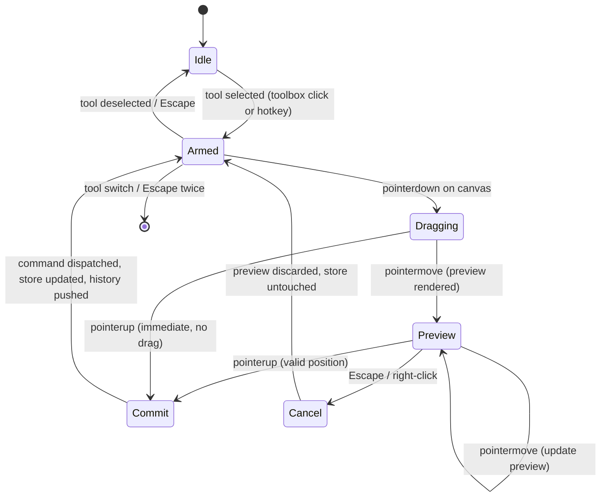
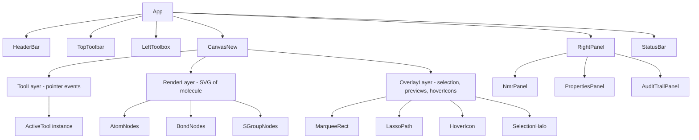
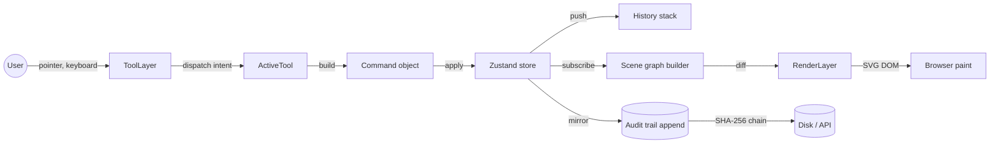
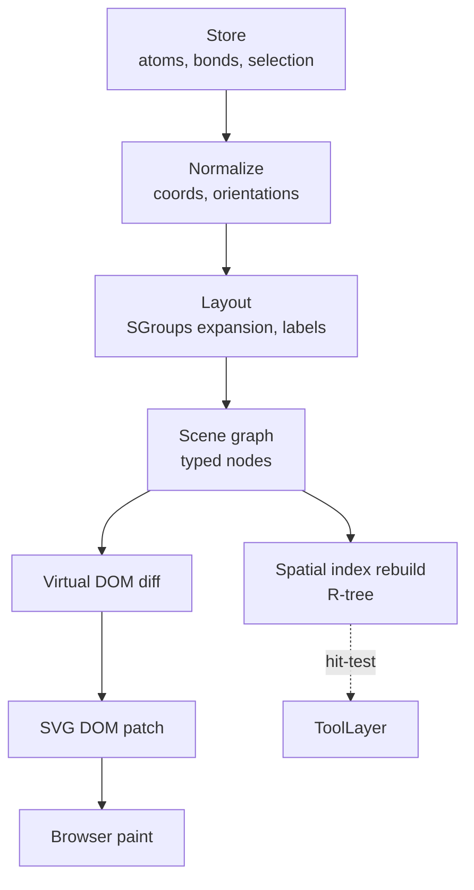
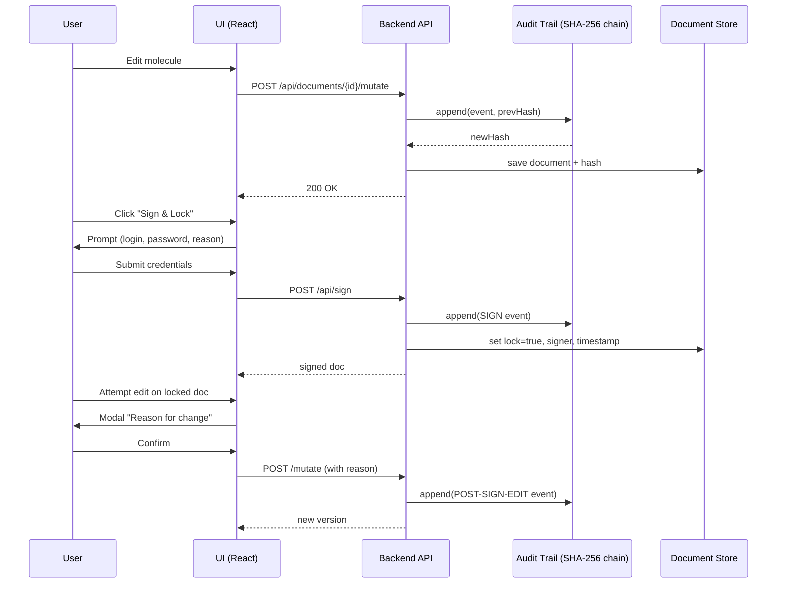

# Wave-4 Redraw — Product Plan (Ketcher-inspired canvas rewrite)

> Plan produit de la vague 4 « redraw » — réimplémentation du moteur de
> dessin et de la toolbox gauche de Kendraw, en **clean room** à partir
> de l'étude Ketcher (EPAM, Apache 2.0) menée en acte 1.
>
> Document collectif assemblé par la party BMAD :
> 📋 **John** (PM) — backlog et matrice de priorité
> 📊 **Mary** (BA) — personas, scénarios et SWOT
> 🎨 **Sally** (UX) — specs d'interaction et design tokens
> 📚 **Paige** (Tech Writer) — glossaire, crosswalk, conventions
>
> **Auteur consolidant** : Jean-Baptiste DONNETTE
> **Date** : 2026-04-18
> **Acte 1 analyse** : [`docs/ketcher-analysis-wave-4.md`](./ketcher-analysis-wave-4.md) (2729 lignes)

---

## Exec summary

Cette vague livre **le squelette fonctionnel d'un nouveau canvas** pour
Kendraw, activable via le feature flag `VITE_ENABLE_NEW_CANVAS` et
**désactivé par défaut** pendant toute la wave-4. 8 user stories P0
(W4-R-01 à W4-R-08) forment le noyau : feature flag, tool abstraction,
parité de rendu, hoverIcon, snap 15°, marquee, drag-déplacement et
quick-edit `/`. Le NMR, le PropertyPanel, l'I/O, la persistence et le
backend restent **intacts et testés en régression**.

Les livrables produits :

| Livrable | Propriétaire | Fichier | Lignes |
|---|---|---|---|
| Backlog + AC + matrice | John | [§2 ci-dessous](#2-backlog-john) | 621 |
| Personas + scénarios + SWOT | Mary | [§3 ci-dessous](#3-personas-et-scenarios-mary) | 753 |
| UX specs par story + layout + tokens | Sally | [§4 ci-dessous](#4-ux-specs-sally) | 996 |
| Glossaire + crosswalk + conventions + Mermaid | Paige | [§5 ci-dessous](#5-glossaire-et-crosswalk-paige) | 413 |

Les 8 stories P0 au centre du contrat :

| # | Story | Effort | Résumé |
|---|---|---|---|
| 1 | W4-R-01 | S | Feature flag + squelette `canvas-new` |
| 2 | W4-R-02 | M | Tool abstraction `{mousedown,mousemove,mouseup,cancel}` |
| 3 | W4-R-03 | S | Rendu Canvas 2D à parité pixel avec l'ancien |
| 4 | W4-R-04 | M | HoverIcon atome + bond (preview CPK) |
| 5 | W4-R-05 | S | Angle snap 15° par défaut, Shift=libre |
| 6 | W4-R-06 | M | Sélection marquee (rectangle + modifiers) |
| 7 | W4-R-07 | L | Drag déplacement + snap live + undo atomique |
| 8 | W4-R-08 | S | `/` quick-edit panneau atome/bond |

Le feature flag garantit zéro régression et une adoption progressive :
les utilisateurs actuels conservent l'ancien canvas ; les beta-testeurs
internes activent le flag via `.env.local`. La sortie du flag à `true`
par défaut est conditionnée au verdict de l'acte 3 (release gate Murat).

---


## 2. Backlog (John)

> Section rédigée par 📋 **John**, Product Manager — 621 lignes.

# Product Plan — Wave-4 Redraw Kendraw

**Auteur** : John (Product Manager, BMAD)
**Date** : 2026-04-18
**Source** : `docs/ketcher-analysis-wave-4.md` sections 8, 9, 10
**Statut** : Draft pour review PO / Tech Lead avant démarrage Wave-4 Redraw

---

## Contexte

L'analyse Ketcher (Wave-4 ACTE-1) a livré un diagnostic sans complaisance : Kendraw V0.4 est solide sur le backend (RDKit), propre sur le data-model (Zustand + Immer + snapshots), et mature sur le NMR. En revanche, la **sensation de dessin** reste en retrait par rapport à Ketcher et ChemDraw. Un chimiste qui bascule entre les trois outils sent immédiatement que Kendraw « est un prototype » — pas parce que le moteur est mauvais, mais parce que les micro-interactions (hover preview, snap angle par défaut, sélection rectangle, drag-move, toggle `/`) sont absentes ou contre-intuitives.

La Wave-4 Redraw vise à combler ce delta avec un **clean-room rewrite du canvas**, inspiré de Ketcher, sans jamais copier de code. Le nouveau canvas vit derrière un feature flag `VITE_ENABLE_NEW_CANVAS`, coexiste avec l'ancien, partage le même `SceneStore`, et sera activé par défaut uniquement quand les 8 stories P0 ci-dessous seront terminées et validées E2E.

Ce document cartographie les 8 stories P0 (`W4-R-01` → `W4-R-08`) identifiées section 9.5 de l'analyse. Chaque story est écrite au format BMAD avec AC testables, référence Ketcher, fichiers à toucher, tests requis, risques, effort, features à préserver et priorité.

Les P1+ (fusion cycles in-place, rotate handle, flip, `<kbd>` inline, etc.) sont volontairement parkés dans `docs/deferred-work-wave-4.md` — ils ne rentrent pas dans cette Wave.

---

## Story W4-R-01 — Feature flag et squelette du package canvas-new

**As a** chimiste utilisateur de Kendraw
**I want** que la réécriture du canvas se déploie sans jamais casser mon workflow actuel
**So that** je peux continuer à dessiner, sauvegarder et exporter mes molécules pendant que l'équipe fait la bascule en coulisses

### Acceptance Criteria

- [ ] AC1 — Un fichier `packages/ui/src/config/feature-flags.ts` expose un objet `FEATURE_FLAGS` avec la propriété booléenne `newCanvas`, lue depuis `import.meta.env.VITE_ENABLE_NEW_CANVAS` et par défaut `false`.
- [ ] AC2 — Un nouveau dossier `packages/ui/src/canvas-new/` est créé avec `CanvasNew.tsx` (composant React stub qui rend un simple `<div>` avec un message « Canvas new WIP » et reçoit les mêmes props que `Canvas.tsx` existant : `store`, `toolState`, callbacks).
- [ ] AC3 — `packages/ui/src/App.tsx` sélectionne au runtime entre `<Canvas>` et `<CanvasNew>` selon `FEATURE_FLAGS.newCanvas`, sans aucune régression visuelle ni fonctionnelle sur l'ancien canvas quand le flag est `false`.
- [ ] AC4 — Le fichier `.env.example` documente la variable `VITE_ENABLE_NEW_CANVAS=false` avec un commentaire explicatif.
- [ ] AC5 — La CI (pnpm lint, typecheck, test, ruff, mypy, pytest) passe à zéro erreur avec le flag `false` comme avec le flag `true`.
- [ ] AC6 — Un test E2E Playwright dédié lance l'application avec `VITE_ENABLE_NEW_CANVAS=true` et vérifie que la page charge sans erreur console et que le message stub est visible.

### Ketcher reference

- Fichier étudié : `/tmp/ketcher-reference/packages/ketcher-react/src/Editor.tsx` (point d'entrée du canvas Ketcher)
- Pattern observé : point d'entrée unique, injection du store via props, séparation stricte entre composant React hôte et logique d'édition.
- Kendraw adaptation inspirée de ce découpage : point d'entrée `CanvasNew.tsx` minimaliste, toute la logique d'édition vivra dans des modules `canvas-new/tools/`, `canvas-new/interactions/`, `canvas-new/render/` à venir dans les stories suivantes.

### Files to touch

- `packages/ui/src/config/feature-flags.ts` (créé)
- `packages/ui/src/canvas-new/CanvasNew.tsx` (créé, stub)
- `packages/ui/src/canvas-new/index.ts` (créé, re-export)
- `packages/ui/src/App.tsx` (switch runtime entre Canvas et CanvasNew)
- `packages/ui/src/env.d.ts` (typer `VITE_ENABLE_NEW_CANVAS`)
- `.env.example` (variable documentée)
- `packages/ui/vite.config.ts` (vérifier `define` ou passthrough Vite)

### Tests required

- Unit : `feature-flags.test.ts` vérifie que le flag est bien `false` par défaut, `true` quand la variable d'env est `'true'`, et ignore les autres valeurs (sécurité).
- E2E Playwright : `canvas-new-flag.spec.ts` lance avec flag `true` et vérifie le stub, puis avec flag `false` et vérifie que l'ancien canvas est présent (sélecteur existant).
- Regression : la suite E2E actuelle (`tests/e2e/*.spec.ts`) passe intégralement avec flag `false`.

### Risks

- Risque de collision si `App.tsx` gère déjà des rendus conditionnels. Mitigation : isoler le switch en haut du render, commentaire explicite.
- Variables d'env Vite exigent le préfixe `VITE_` — oubli fréquent. Mitigation : test unitaire dédié.

### Effort

S

### Kendraw features to preserve

- `packages/nmr/` entier, `PropertyPanel.tsx`, `api-client`, persistence, audit trail, I/O CDXML/MOL/SMILES/KDX/JCAMP — aucun de ces modules n'est touché.
- L'ancien `Canvas.tsx` reste intact et reste la route par défaut jusqu'à la fin de la Wave.

### Priority + rank

P0 — rank 1/8 (prérequis de toutes les autres stories)

---

## Story W4-R-02 — Tool abstraction uniformisée `{mousedown, mousemove, mouseup, cancel}`

**As a** chimiste qui ajoute fréquemment des outils custom (templates, groupes, annotations)
**I want** que chaque outil du canvas expose un contrat d'événements identique
**So that** dessiner se fait avec un comportement prévisible quel que soit l'outil, et l'ajout de nouveaux outils par l'équipe ne régresse jamais les outils existants

### Acceptance Criteria

- [ ] AC1 — Un fichier `packages/ui/src/canvas-new/tools/Tool.ts` définit une interface TypeScript `Tool` avec les méthodes obligatoires `mousedown(ctx, event)`, `mousemove(ctx, event)`, `mouseup(ctx, event)`, `cancel(ctx)` et la méthode optionnelle `keydown(ctx, event)`.
- [ ] AC2 — Le type `ToolContext` (passé en premier argument) expose au minimum : `store`, `camera`, `spatialIndex`, `currentCursorWorld`, `currentCursorScreen`, `hoveredItem`, `setPreview(preview)`.
- [ ] AC3 — Au moins trois outils de référence (`AtomTool`, `BondTool`, `EraserTool`) sont implémentés via ce contrat dans `packages/ui/src/canvas-new/tools/` et couvrent mousedown/move/up + cancel (Esc).
- [ ] AC4 — Un `ToolRouter` unique dans `CanvasNew.tsx` attache les listeners DOM au `<canvas>` et délègue à l'outil actif ; `CanvasNew.tsx` reste en dessous de 400 lignes (contre 1729 pour l'ancien).
- [ ] AC5 — Le switch d'outil (changement de `toolState.selectedTool`) appelle automatiquement `cancel()` sur l'outil sortant pour éviter des états fantômes.
- [ ] AC6 — Chaque outil de référence a un test unitaire qui instancie l'outil, simule une séquence d'événements, et vérifie les mutations attendues sur le store.

### Ketcher reference

- Fichier étudié : `/tmp/ketcher-reference/packages/ketcher-core/src/application/editor/tools/Base.ts` et `tool/atom.ts`, `tool/bond.ts`
- Pattern observé : chaque outil implémente une méthode par événement ; le routeur central dispatche selon l'outil actif ; cancel() pour nettoyer preview et drag en cours.
- Kendraw adaptation inspirée : contrat TypeScript immutable sur la forme de l'outil, méthodes pures sauf pour `setPreview` ; pas de classe mutable, on privilégie des factories fonctionnelles qui retournent un `Tool` figé.

### Files to touch

- `packages/ui/src/canvas-new/tools/Tool.ts` (interface)
- `packages/ui/src/canvas-new/tools/ToolContext.ts` (type)
- `packages/ui/src/canvas-new/tools/AtomTool.ts`
- `packages/ui/src/canvas-new/tools/BondTool.ts`
- `packages/ui/src/canvas-new/tools/EraserTool.ts`
- `packages/ui/src/canvas-new/tools/index.ts`
- `packages/ui/src/canvas-new/CanvasNew.tsx` (ajout du ToolRouter)

### Tests required

- Unit : un fichier de test par outil, plus `ToolRouter.test.ts` qui vérifie la bascule et le cancel sur switch.
- E2E Playwright : `canvas-new-tools.spec.ts` active le flag, sélectionne AtomTool, clique, vérifie atome créé ; même chose pour BondTool et EraserTool.
- Regression : bascule flag `false`, la suite existante de tests d'outils sur l'ancien canvas reste verte.

### Risks

- Sur-abstraction : on peut être tenté de rendre l'interface trop générique dès maintenant. Mitigation : se limiter aux signatures effectivement utilisées par les trois outils de référence ; refactor quand un quatrième outil arrive.
- Fuite d'état entre outils via `ToolContext`. Mitigation : `setPreview` accepte `null` pour reset, appelé systématiquement en `cancel()`.

### Effort

M

### Kendraw features to preserve

- Les raccourcis clavier existants (C/N/O/1/2/3/W/etc.) continuent de fonctionner via le même registre `group-label-hotkeys` ; le nouveau canvas consomme ce registre sans le modifier.
- Le `SceneStore` Zustand/Immer n'est pas muté — les outils appellent les mêmes actions store que l'ancien canvas.

### Priority + rank

P0 — rank 2/8 (socle technique de R-04, R-05, R-06, R-07, R-08)

---

## Story W4-R-03 — Rendu Canvas 2D partagé avec l'ancien canvas

**As a** chimiste qui veut pouvoir basculer entre ancien et nouveau canvas sans changement visuel perceptible
**I want** que le rendu pixel-à-pixel de mes molécules soit strictement identique entre les deux canvas
**So that** la confiance dans la bascule reste intacte et je peux évaluer l'ergonomie sans me poser de questions sur la fidélité du rendu

### Acceptance Criteria

- [ ] AC1 — Le nouveau canvas délègue le rendu à `packages/renderer-canvas/` exactement comme l'ancien, via l'export public `render(document, ctx, camera, options)`.
- [ ] AC2 — Aucun fichier de `packages/renderer-canvas/` n'est modifié ; les imports se font uniquement depuis l'API publique.
- [ ] AC3 — Une boucle `requestAnimationFrame` dans `CanvasNew.tsx` repeint quand le store émet une notification de changement, avec throttle à 60 fps maximum.
- [ ] AC4 — Le canvas gère correctement DPR (device pixel ratio) via scale au setup, identique à l'ancien.
- [ ] AC5 — Un test de non-régression visuelle Playwright charge une molécule de référence (benzène + hydroxyle) dans les deux canvas et vérifie que les deux captures d'écran sont identiques à 1 pixel près.
- [ ] AC6 — Le rendu supporte déjà tous les types d'éléments existants (atomes, liaisons, flèches, annotations, formes, groupes) sans perte — rien de chimique n'est régressé.

### Ketcher reference

- Fichier étudié : `/tmp/ketcher-reference/packages/ketcher-core/src/application/render/restruct/restruct.ts`
- Pattern observé : séparation domaine (Struct) / rendu (ReStruct) avec dirty-tracking.
- Kendraw adaptation inspirée : volontairement **plus simple** — on re-peint tout à chaque frame, c'est suffisant sous 200 atomes et ça évite la complexité du dirty-tracking. Section 11.2 de l'analyse justifie ce choix.

### Files to touch

- `packages/ui/src/canvas-new/render/renderLoop.ts` (créé)
- `packages/ui/src/canvas-new/CanvasNew.tsx` (branchement de la loop)
- `packages/renderer-canvas/` — aucun fichier modifié

### Tests required

- Unit : `renderLoop.test.ts` vérifie que la loop se déclenche sur store change, s'arrête au unmount, et respecte le throttle 60 fps.
- E2E Playwright : `canvas-new-render-parity.spec.ts` charge la molécule de référence dans l'ancien canvas, capture, bascule flag, recharge, capture, compare.
- Regression : la suite NMR (`nmr-prediction.spec.ts`) continue de passer dans le nouveau canvas (affichage chemical shifts sur atomes).

### Risks

- DPR mal géré → flou sur Retina. Mitigation : test visuel sur devicePixelRatio=2.
- Fuite mémoire si la rAF n'est pas annulée au unmount. Mitigation : cleanup explicite dans le useEffect.

### Effort

S

### Kendraw features to preserve

- Tout le module `packages/renderer-canvas/` est considéré comme API externe intouchable.
- Les overlays graphiques (NMR highlights, spectre, selection) continuent de fonctionner via `graphic-overlays.ts`.

### Priority + rank

P0 — rank 3/8 (prérequis visuel pour R-04 hover preview)

---

## Story W4-R-04 — HoverIcon atome et bond

**As a** chimiste qui dessine rapidement une molécule
**I want** un preview sémantique au survol (couleur de l'élément pour atomes, épaisseur reflétant l'ordre pour bonds)
**So that** je sais avant de cliquer ce que mon clic va produire, et le dessin devient fluide comme dans Ketcher ou ChemDraw

### Acceptance Criteria

- [ ] AC1 — Quand l'outil actif est un atome (ex. outil N) et que la souris survole une zone vide, un cercle semi-transparent aux couleurs CPK de l'élément apparaît à la position du curseur.
- [ ] AC2 — Quand l'outil actif est un atome et que la souris survole un atome existant, un halo autour de l'atome indique qu'un clic va remplacer le label ; l'halo utilise la couleur de l'élément cible.
- [ ] AC3 — Quand l'outil actif est un atome et que la souris survole un bond, l'extrémité la plus proche du curseur est mise en évidence pour signifier qu'un clic va ajouter un atome à cette extrémité.
- [ ] AC4 — Quand l'outil actif est un bond (ex. 1/2/3/wedge/hash), le survol d'une zone vide affiche un trait fantôme depuis l'atome hoveré (s'il y en a un) jusqu'au curseur, avec l'épaisseur reflétant l'ordre.
- [ ] AC5 — Le preview est purement visuel, il n'est jamais écrit dans le store — aucun snapshot d'historique ne doit être créé par un simple mouvement de souris.
- [ ] AC6 — Le preview est annulé immédiatement sur `mouseleave`, `cancel()`, switch d'outil ou appui Esc.
- [ ] AC7 — Les performances restent fluides : le survol ne descend pas sous 60 fps sur une molécule de 100 atomes (mesuré via Playwright + Performance API).

### Ketcher reference

- Fichier étudié : `/tmp/ketcher-reference/packages/ketcher-react/src/script/editor/Editor.ts` (hover API) et `/tmp/ketcher-reference/packages/ketcher-core/src/application/editor/tools/atom.ts` (`hoverIcon` preview)
- Pattern observé : l'éditeur maintient un `hoverItem` et l'outil actif publie un preview via une couche spéciale du renderer.
- Kendraw adaptation inspirée : `ToolContext.setPreview(preview | null)` est la seule API ; le renderer consomme le preview dans une passe finale après le document, avec `ctx.globalAlpha` réduit. Aucun écho dans le store.

### Files to touch

- `packages/ui/src/canvas-new/render/previewLayer.ts` (créé — dessine le preview au-dessus du document)
- `packages/ui/src/canvas-new/tools/AtomTool.ts` (publication du preview)
- `packages/ui/src/canvas-new/tools/BondTool.ts` (publication du preview)
- `packages/ui/src/canvas-new/CanvasNew.tsx` (intégration au render loop)
- `packages/ui/src/canvas-new/interactions/useHoveredItem.ts` (créé — hook qui lit le SpatialIndex)

### Tests required

- Unit : `previewLayer.test.ts` vérifie que les paramètres de dessin matchent l'élément CPK attendu ; `AtomTool.test.ts` simule un mousemove et vérifie l'appel `setPreview` avec les bons paramètres.
- E2E Playwright : `canvas-new-hover-preview.spec.ts` active AtomTool N, déplace la souris, attend un repaint, screenshot compare avec fixture.
- Regression : tests existants d'insertion d'atome continuent de passer ; aucun snapshot d'historique ne doit être créé par un simple survol.

### Risks

- Le preview peut masquer visuellement l'élément survolé si mal dosé. Mitigation : `globalAlpha` strictement inférieur à 0.5, halo autour et non par-dessus le label.
- Risque de repeint excessif à chaque mousemove. Mitigation : le mousemove déclenche un `requestAnimationFrame` coalescé, pas un repaint direct.

### Effort

M

### Kendraw features to preserve

- Les CPK colors existantes dans `renderer-canvas` sont la seule source de vérité ; on les réutilise sans les dupliquer.
- Le curseur d'outil existant (emoji + label) reste affiché au niveau du DOM ; le preview s'ajoute par-dessus, il ne remplace pas.

### Priority + rank

P0 — rank 4/8 (signature UX de la Wave-4, sine qua non de la fluidité)

---

## Story W4-R-05 — Angle snap 15° par défaut avec Shift pour libre

**As a** chimiste qui trace des liaisons selon les angles standard de la chimie organique
**I want** un snap d'angle à 15° activé par défaut, avec Shift pour le désactiver ponctuellement
**So that** je trace des chaînes et cycles propres sans effort, et je peux quand même poser des liaisons à angle libre quand la structure l'exige

### Acceptance Criteria

- [ ] AC1 — Le drag d'un bond depuis un atome existant ou depuis un atome implicite snappe automatiquement à l'angle multiple de 15° le plus proche.
- [ ] AC2 — Maintenir Shift pendant le drag désactive le snap et permet un angle libre ; relâcher Shift pendant le drag réactive le snap instantanément.
- [ ] AC3 — Le raccourci clavier existant `Ctrl+E` (toggle de snap 30°) est réaffecté à « toggle snap 15°/30° » ; l'état est mémorisé dans `toolState.angleSnapStep` et visible dans la StatusBar.
- [ ] AC4 — La StatusBar affiche en permanence le pas de snap actif et indique « Shift pour libre ».
- [ ] AC5 — Le snap est visuel pendant le drag (la ligne fantôme se colle aux angles) avant même le mouseup.
- [ ] AC6 — Une tolérance hysteresis évite le flickering quand le curseur est exactement sur la frontière entre deux snap slots.
- [ ] AC7 — Les angles produits côté données sont exacts à 0.001 rad près par rapport à l'angle théorique (ex. 15°, 30°, 45°, 60°, 90°).

### Ketcher reference

- Fichier étudié : `/tmp/ketcher-reference/packages/ketcher-core/src/application/editor/shared/utils.ts` (`fracAngle`)
- Pattern observé : snap par défaut à 30°, désactivé via Ctrl.
- Kendraw adaptation inspirée : Kendraw privilégie 15° par défaut (plus proche de ChemDraw) et bascule la modifier sur **Shift=libre** (15° couvre déjà 30° par nature). `fracAngle` est ré-implémenté from scratch en utilitaire pur dans `canvas-new/interactions/snapAngle.ts`.

### Files to touch

- `packages/ui/src/canvas-new/interactions/snapAngle.ts` (créé)
- `packages/ui/src/canvas-new/tools/BondTool.ts` (consommation du snap)
- `packages/ui/src/StatusBar.tsx` (affichage du pas actif)
- `packages/ui/src/workspace-store.ts` (persistance du pas dans toolState)
- `packages/ui/src/__tests__/angle-snap.test.ts` (étendre, le fichier existe déjà pour 30°)

### Tests required

- Unit : `snapAngle.test.ts` couvre les 24 angles multiples de 15°, les frontières d'hystérésis, Shift=libre, et le toggle 15°/30°.
- E2E Playwright : `canvas-new-bond-snap.spec.ts` active BondTool, drag depuis un atome, vérifie que la liaison finale est alignée à 60° ; test séparé avec Shift maintenu vérifie qu'un angle arbitraire est conservé.
- Regression : le fichier `angle-snap.test.ts` existant passe toujours dans l'ancien canvas (Ctrl+E toggle 30°).

### Risks

- Changement de comportement par défaut : des utilisateurs habitués à 30° peuvent être surpris. Mitigation : note dans le changelog, StatusBar explicite, toggle clavier.
- Hystérésis mal dosée → micro-sauts inconfortables. Mitigation : marge de 0.5° en entrée/sortie de slot.

### Effort

S

### Kendraw features to preserve

- Le raccourci `Ctrl+E` reste assigné au toggle de snap — on ne change pas la combinaison, seulement les valeurs togglées.
- Les tests d'angle existants restent des référentiels et sont étendus, pas remplacés.

### Priority + rank

P0 — rank 5/8 (gain ergonomique immédiat, effort faible)

---

## Story W4-R-06 — Sélection rectangle marquee

**As a** chimiste qui veut manipuler une portion d'une molécule (ex. un groupe fonctionnel)
**I want** tracer un rectangle de sélection à la souris pour sélectionner atomes, liaisons, flèches, annotations inclus
**So that** je n'ai plus besoin de cliquer un à un ni de passer par un flood-select qui prend tout le fragment

### Acceptance Criteria

- [ ] AC1 — Un nouvel outil SelectMarqueeTool est disponible depuis la toolbox gauche, raccourci clavier `V` (à valider non-conflit dans `group-label-hotkeys`).
- [ ] AC2 — Sur mousedown dans une zone vide, le SelectMarqueeTool démarre un rectangle de sélection ; sur mousemove, le rectangle se redimensionne en suivant le curseur ; sur mouseup, tous les atomes/liaisons/flèches/annotations dont la bounding box intersecte le rectangle passent en sélection.
- [ ] AC3 — Le rectangle est visuellement rendu avec un contour en pointillé et un remplissage très léger (alpha 0.1) dans la couleur primaire Kendraw.
- [ ] AC4 — Shift+drag **ajoute** à la sélection existante sans la vider.
- [ ] AC5 — Ctrl+drag **toggle** chaque item touché par le rectangle (ajoute si absent, retire si présent).
- [ ] AC6 — Un mousedown sur un item existant bascule automatiquement en mode click-select (pas de marquee — on ne sélectionne qu'un item) ; le marquee ne démarre que sur fond vide.
- [ ] AC7 — La sélection est persistée dans le store via `selection: { atoms: Set, bonds: Set, arrows: Set, annotations: Set }` en un seul snapshot d'historique.
- [ ] AC8 — Esc pendant le drag annule le rectangle sans modifier la sélection préalable.

### Ketcher reference

- Fichier étudié : `/tmp/ketcher-reference/packages/ketcher-core/src/application/editor/tools/select/SelectBase.ts`
- Pattern observé : rectangle + lasso partagent le SelectBase, avec une phase « test pour chaque item si inside » sur mouseup ; shift/ctrl modificateurs en début de phase.
- Kendraw adaptation inspirée : on commence par le marquee seul (lasso parké en P1). `selection-hit-test.ts` fait le test inclusion bounding box ; lasso viendra réutiliser la même API avec un polygone au lieu d'un rectangle.

### Files to touch

- `packages/ui/src/canvas-new/tools/SelectMarqueeTool.ts` (créé)
- `packages/ui/src/canvas-new/interactions/selectionHitTest.ts` (créé)
- `packages/ui/src/canvas-new/render/selectionOverlay.ts` (créé — rendu du rectangle et des items sélectionnés)
- `packages/ui/src/ToolPalette.tsx` (ajout du bouton, icône, tooltip)
- `packages/ui/src/group-label-hotkeys.ts` (raccourci `V`)

### Tests required

- Unit : `selectionHitTest.test.ts` couvre rectangle vide, rectangle couvrant tout, intersection partielle, shift/ctrl.
- E2E Playwright : `canvas-new-marquee.spec.ts` charge une molécule de 6 atomes, trace un rectangle englobant 3 atomes, vérifie `selection.atoms.size === 3` ; test séparé pour Shift+marquee (ajout), Ctrl+marquee (toggle), Esc (cancel).
- Regression : flood-select existant via double-clic continue de fonctionner sur les deux canvas.

### Risks

- Conflit avec l'outil pan (Space+drag) si mal géré. Mitigation : `SelectMarqueeTool` ne démarre jamais si la touche Space est tenue.
- Raccourci `V` peut entrer en conflit avec coller `Ctrl+V`. Mitigation : le listener ignore les events avec `ctrlKey` ou `metaKey`.

### Effort

M

### Kendraw features to preserve

- Flood-select existant (double-clic) reste intouché — ce sont deux gestes complémentaires.
- Le panneau de propriétés affiche correctement les propriétés agrégées d'une multi-sélection (déjà géré côté `PropertyPanel.tsx`).

### Priority + rank

P0 — rank 6/8 (pré-requis de R-07 drag de sélection)

---

## Story W4-R-07 — Drag déplacement de sélection avec snap live et undo atomique

**As a** chimiste qui a sélectionné un fragment et veut le repositionner sans écraser sa topologie
**I want** pouvoir draguer la sélection à la souris, voir un snap grid/anchor pendant le drag, et obtenir un unique snapshot undo à la fin
**So that** je réorganise ma structure proprement, je peux revenir en arrière d'un seul Ctrl+Z, et je ne pollue pas mon historique de pas intermédiaires

### Acceptance Criteria

- [ ] AC1 — Un mousedown sur un item faisant partie de la sélection courante démarre un drag-move de toute la sélection ; un mousedown sur un item hors sélection bascule la sélection vers ce seul item puis démarre le drag.
- [ ] AC2 — Pendant le drag, tous les atomes sélectionnés sont translatés visuellement (preview, pas encore dans le store) ; les liaisons attachées suivent même si seul un de leurs atomes est sélectionné.
- [ ] AC3 — Le snap grid existant (`grid-snap.test.ts`) est appliqué live pendant le drag — le curseur montre la position snappée, pas la position brute.
- [ ] AC4 — Le snap anchor existant (`anchor-snap.test.ts`) continue de fonctionner : quand un atome draggé s'approche d'un autre atome à distance < seuil, il se merge visuellement (halo d'indication).
- [ ] AC5 — Sur mouseup, **une seule** action store est commitée avec un **unique** snapshot d'historique représentant la translation totale.
- [ ] AC6 — Esc pendant le drag annule la translation et restaure la position de départ sans créer de snapshot.
- [ ] AC7 — Si un merge anchor est actif au mouseup, la fusion atomes produit aussi un unique snapshot avec l'opération combinée move+merge.
- [ ] AC8 — Les performances tiennent 60 fps pendant le drag sur une sélection de 50 atomes (mesuré Performance API).

### Ketcher reference

- Fichier étudié : `/tmp/ketcher-reference/packages/ketcher-core/src/application/editor/tools/select/SelectBase.ts` (phase `mousemove`) et `Command.ts`
- Pattern observé : pendant le drag, Ketcher applique des transformations temporaires visuelles ; à mouseup, une Command réversible est poussée sur l'histoire.
- Kendraw adaptation inspirée : on n'importe pas Command pattern (section 11.5 de l'analyse — on reste sur snapshots Immer FIFO). On isole la translation visuelle dans `dragMovePreview` et on commit une seule mutation `translateSelection(dx, dy)` sur le store à mouseup.

### Files to touch

- `packages/ui/src/canvas-new/tools/SelectMarqueeTool.ts` (étendu — gère aussi le drag-move)
- `packages/ui/src/canvas-new/interactions/dragMove.ts` (créé)
- `packages/ui/src/canvas-new/render/dragPreviewLayer.ts` (créé)
- `packages/ui/src/workspace-store.ts` (action `translateSelection(dx, dy, mergeInfo?)`)
- `packages/ui/src/anchor-snap.ts` (réutilisé tel quel)

### Tests required

- Unit : `dragMove.test.ts` couvre translation pure, translation + merge, cancel Esc, snap grid, snap anchor.
- E2E Playwright : `canvas-new-drag-move.spec.ts` sélectionne 3 atomes via marquee, drague, vérifie translation + une seule entrée dans l'historique ; test séparé pour Esc cancel ; test séparé pour merge.
- Regression : tests anchor-snap et grid-snap existants passent dans le nouveau canvas.

### Risks

- Commit multi-snapshot si on confond preview et store. Mitigation : un seul `store.translateSelection()` en fin de mouseup, preview purement visuel.
- Performance sur grosse sélection. Mitigation : recalcul bounding box incrémental, pas O(n) full à chaque frame.
- Fusion anchor + multi-sélection : cas d'interaction complexe. Mitigation : AC7 dédié avec test E2E explicite.

### Effort

L

### Kendraw features to preserve

- Les modules `anchor-snap.ts` et grid snap existants sont des dépendances intouchées, juste consommées par `dragMove.ts`.
- L'historique FIFO 200 snapshots conserve son budget — on ne stacke pas de snapshots intermédiaires.

### Priority + rank

P0 — rank 7/8 (story la plus lourde, dépend de R-06)

---

## Story W4-R-08 — Touche `/` pour mini-panneau de propriétés au survol

**As a** chimiste qui veut éditer rapidement une charge ou un isotope sans quitter le clavier
**I want** presser `/` pendant que je survole un atome ou un bond pour ouvrir un mini-panneau d'édition rapide
**So that** je garde le flux de dessin sans basculer vers le panneau de propriétés de droite

### Acceptance Criteria

- [ ] AC1 — Presser `/` (sans modifier) alors qu'un atome est survolé ouvre un popover positionné près du curseur avec les champs : élément (autocomplete), charge, isotope, radicaux, hydrogènes explicites.
- [ ] AC2 — Presser `/` alors qu'un bond est survolé ouvre un popover avec les champs : ordre, type stéréo (plain/wedge/hash/double cis/trans), topologie (chain/ring).
- [ ] AC3 — Presser `/` alors que rien n'est survolé n'ouvre rien et n'émet pas d'erreur console.
- [ ] AC4 — Le popover se ferme sur Enter (commit), Esc (cancel), ou clic en dehors ; Enter pousse un unique snapshot d'historique.
- [ ] AC5 — Le popover est navigable au clavier : Tab entre les champs, Enter commit, Esc annule, flèches pour les select.
- [ ] AC6 — Le popover ne masque jamais l'atome ou le bond édité : positionnement automatique au-dessus, en-dessous ou à côté selon la place disponible.
- [ ] AC7 — Le raccourci `/` est désactivé lorsque le focus est dans un champ texte (ImportDialog, annotations) pour ne pas casser la frappe.
- [ ] AC8 — Un test E2E vérifie le cycle complet : survol atome, `/`, changer charge à +1, Enter, vérification store + undo Ctrl+Z rétablit charge 0.

### Ketcher reference

- Fichier étudié : `/tmp/ketcher-reference/packages/ketcher-react/src/script/ui/action/hotkeys.ts` (mapping `/` → dialog hover)
- Pattern observé : raccourci contextuel qui ouvre un dialog sur l'item survolé, commit en un snapshot à la fermeture.
- Kendraw adaptation inspirée : on réutilise les composants d'édition déjà présents dans `PropertyPanel.tsx` (champs charge/isotope/ordre) via des sous-composants extraits. Positionnement via `@floating-ui/react` si la dépendance est déjà présente, sinon calcul manuel.

### Files to touch

- `packages/ui/src/canvas-new/interactions/quickEditPopover.tsx` (créé)
- `packages/ui/src/canvas-new/interactions/useQuickEditHotkey.ts` (créé — écoute `/`)
- `packages/ui/src/PropertyPanel.tsx` (extraction de sous-composants réutilisables, sans régression du panneau droit)
- `packages/ui/src/hooks/useIsEditingText.ts` (réutilisé pour gating clavier)
- `packages/ui/src/workspace-store.ts` (action `updateAtomProps`, `updateBondProps` si absentes)

### Tests required

- Unit : `quickEditPopover.test.tsx` rend le popover, simule input, vérifie commit ; `useQuickEditHotkey.test.ts` vérifie le gating (ignore si text field focus, ignore si rien de survolé).
- E2E Playwright : `canvas-new-quick-edit.spec.ts` charge benzène, survol d'un carbone, `/`, charge à +1, Enter, vérifie store, Ctrl+Z, vérifie rétabli.
- Regression : `shortcut-filter.test.ts` et `hotkey-gating.test.ts` existants passent toujours.

### Risks

- Conflit avec raccourcis navigateur (Firefox : `/` ouvre la recherche rapide). Mitigation : `preventDefault` systématique quand un item est survolé dans le canvas.
- Extraction de sous-composants de PropertyPanel : risque de régression du panneau droit. Mitigation : PropertyPanel importe les sous-composants extraits sans changer son rendu, tests visuels avant/après.

### Effort

S

### Kendraw features to preserve

- Le panneau de propriétés de droite (`PropertyPanel.tsx`) reste le lieu de référence pour l'édition avancée (InChI, SMILES, MW, LogP, tPSA, Lipinski) ; le quick-edit est un raccourci pour les champs essentiels seulement.
- Les raccourcis existants qui utilisent des touches alphanumériques (C/N/O/etc.) ne sont pas impactés.

### Priority + rank

P0 — rank 8/8 (polish final, effort faible, impact fort)

---

## Priority Matrix

| # | Story | Ketcher ref | Effort | Rank | Impact |
|---|---|---|---|---|---|
| 1 | W4-R-01 Feature flag + squelette canvas-new | `packages/ketcher-react/src/Editor.tsx` | S | 1 | Fondation — sans ça rien d'autre ne démarre en sécurité |
| 2 | W4-R-02 Tool abstraction `{mousedown,mousemove,mouseup,cancel}` | `ketcher-core/src/application/editor/tools/Base.ts` | M | 2 | Socle technique qui rend R-04/05/06/07/08 possibles ; réduit `Canvas.tsx` de 1729 à <400 lignes |
| 3 | W4-R-03 Rendu Canvas 2D partagé | `ketcher-core/src/application/render/restruct/restruct.ts` | S | 3 | Parité visuelle garantie, confiance de bascule pour les utilisateurs |
| 4 | W4-R-04 HoverIcon atome + bond | `ketcher-react/src/script/editor/Editor.ts`, `tools/atom.ts` | M | 4 | Signature UX Wave-4 — « ça marche comme Ketcher » |
| 5 | W4-R-05 Snap 15° par défaut Shift=libre | `ketcher-core/src/application/editor/shared/utils.ts` | S | 5 | Gain ergo immédiat, dessin de chaînes/cycles fluide |
| 6 | W4-R-06 Sélection rectangle marquee | `ketcher-core/src/application/editor/tools/select/SelectBase.ts` | M | 6 | Débloque la manipulation de groupes sans flood-select |
| 7 | W4-R-07 Drag sélection + snap live + undo atomique | `ketcher-core/src/application/editor/tools/select/SelectBase.ts` + `Command.ts` | L | 7 | Pièce la plus complexe, requise pour repositionner des fragments proprement |
| 8 | W4-R-08 Touche `/` mini-panneau quick-edit | `ketcher-react/src/script/ui/action/hotkeys.ts` | S | 8 | Polish clavier-first, accélère l'édition des charges/isotopes |

---

## Notes transverses

### Features Kendraw à préserver systématiquement (rappel section 10 de l'analyse)

- `packages/nmr/` entier (DEPT, multiplets, overlay, intégration, solvants, confidence, highlighting).
- `packages/ui/src/PropertyPanel.tsx` (MW, LogP, tPSA, Lipinski, InChI, SMILES).
- `packages/api-client/` (client FastAPI vers `/api/v1/compute/*`).
- `packages/io/` : CDXML parser/writer, MOL V2000, SMILES, KDX, JCAMP-DX.
- `packages/constraints/` (valence et règles chimiques).
- `packages/persistence/` (audit trail hash-chain, record lock, ESig).
- `packages/io/src/pubchem/`, scripts Traefik/Docker, backend Python entier, `scripts/full-check.sh`, CI GitHub Actions.

### Coexistence ancien/nouveau canvas

Les 8 stories s'exécutent **derrière** le feature flag `VITE_ENABLE_NEW_CANVAS` (par défaut `false`). Les deux canvas partagent le **même** `SceneStore` — zéro migration, bascule sans perte. Le flag ne passe à `true` par défaut qu'après validation pleine des 8 AC-sets via la suite E2E.

### Ce qui est hors scope Wave-4 Redraw (rappel)

Parké dans `docs/deferred-work-wave-4.md` pour Wave-5 ou plus tard :

- Lasso de sélection (P0-03 partiel — le marquee suffit pour la Wave).
- Rotate handle et flip H/V sur sélection (P1-05, P1-06).
- Sous-menus responsive collapse (P1-01).
- `<kbd>` inline (P1-02).
- Fusion de cycles in-place (P1-03).
- Groupes expansibles Ph/Me/Boc (P1-04, partiellement amorcé Wave-3).
- Règles hydrogènes implicites Ketcher-like (P1-07).
- Copie MOL/KET/image via Ctrl+Shift+M/K/F (P1-08).
- Toggle aromaticité cercle (P2-01), fragments explicites (P2-02), library picker (P2-03), deselect Ctrl+Shift+A (P2-04), Shift+Tab cycle sélection (remplacé par V/L/F — 11.10 de l'analyse).
- OCR, R-groups complexes, polymer editor, 3D viewer, collaboration temps réel (P3-01→05).

### Rappels cadrage

- **Clean-room** : aucun fichier sous `/tmp/ketcher-reference/` n'est copié ou dérivé textuellement. Les stories mentionnent les fichiers Ketcher uniquement comme **référence conceptuelle** ; l'implémentation Kendraw est rédigée from scratch par l'équipe.
- **Licences** : Ketcher est Apache 2.0 ; même si la copie serait légalement possible, on préserve une identité visuelle et technique Kendraw propre (icônes Lucide + textuelles, Zustand + Immer, Canvas 2D natif — section 11 de l'analyse).
- **CI** : chaque story ajoute ses tests à la suite existante ; les 6 checks (eslint, tsc, vitest, ruff, mypy, pytest) plus Playwright E2E restent obligatoires avant push, par règle `CLAUDE.md`.

### Séquence d'exécution recommandée

La dépendance technique impose la séquence suivante (aucun parallélisme possible sur les 3 premières stories) :

1. R-01 (fondation).
2. R-02 (socle tool abstraction) en parallèle possible avec R-03 (rendu partagé).
3. R-04 dès que R-02 et R-03 sont mergées.
4. R-05 en parallèle de R-04 (dépend seulement de R-02).
5. R-06 après R-02.
6. R-07 strictement après R-06.
7. R-08 après R-04 (dépend du hover pour cibler l'item).

Cette séquence minimise les merges conflictuels et garde `main` stable pendant toute la Wave.

---

## Grille de Definition of Done (DoD) partagée

Chaque story W4-R-XX n'est considérée « done » que si l'intégralité des critères suivants est vérifiée. Rien n'est merged sans cocher la grille entière. L'ordre des vérifications est volontaire : on commence par le code, on finit par la comm.

- [ ] Tous les AC de la story sont implémentés et vérifiables à l'œil nu par le reviewer.
- [ ] `pnpm lint` retourne zéro erreur (et zéro warning nouveau introduit par la story).
- [ ] `pnpm typecheck` retourne zéro erreur.
- [ ] `pnpm test` passe à 100 % sur le sous-ensemble impacté.
- [ ] `cd backend && uv run ruff check .` retourne zéro erreur (si la story touche au backend — peu probable dans cette Wave, mais le check reste obligatoire).
- [ ] `cd backend && uv run ruff format --check .` retourne zéro reformat.
- [ ] `cd backend && uv run mypy kendraw_api/ kendraw_chem/ kendraw_settings/ kendraw_observability/` retourne zéro erreur.
- [ ] `cd backend && uv run pytest -v` retourne zéro failure.
- [ ] `pnpm test:e2e` passe, y compris les nouveaux spec Playwright ajoutés par la story.
- [ ] Le feature flag `VITE_ENABLE_NEW_CANVAS=false` laisse l'ancien canvas fonctionner sans régression visible.
- [ ] Le feature flag `VITE_ENABLE_NEW_CANVAS=true` charge le nouveau canvas et les AC de la story sont vérifiables.
- [ ] La story mentionne ses fichiers Ketcher de référence uniquement en commentaire de PR — aucun fichier source sous `/tmp/ketcher-reference/` n'est importé, copié, ou adapté textuellement.
- [ ] Le CHANGELOG interne (ou les notes de release Wave-4) mentionne la story dans une entrée dédiée.
- [ ] La PR GitHub est revue par au moins un deuxième développeur avant merge sur `main`.

## Backlog de risques transverses Wave-4

Les risques spécifiques aux stories sont consignés dans chaque carte. Les risques transverses ci-dessous s'appliquent à l'ensemble de la Wave et appellent une veille continue du Product Manager et du Tech Lead.

### Risque T-01 : divergence de rendu entre ancien et nouveau canvas

Si le nouveau canvas diverge même de quelques pixels, la confiance dans la bascule s'effondre. Mitigation : R-03 impose un test Playwright screenshot-compare pixel à pixel ; toute PR qui casse ce test est bloquée. Escalade : si le test est instable, on freeze les changements Wave-4 jusqu'à stabilisation du diff.

### Risque T-02 : explosion de la taille de `CanvasNew.tsx`

Le vrai piège est de recréer un monolithe de 1729 lignes sous un autre nom. Mitigation : l'AC4 de R-02 fixe une borne dure à 400 lignes pour `CanvasNew.tsx` ; le reviewer refuse le merge si la borne est franchie. Tout dépassement est un signal d'alerte architectural.

### Risque T-03 : régression silencieuse des raccourcis clavier

Kendraw a déjà 30+ raccourcis ; ajouter `V` (marquee) et `/` (quick-edit) peut collisionner silencieusement. Mitigation : les stories R-06 et R-08 ajoutent leurs checks au fichier `group-label-hotkeys.test.ts` existant ; une revue manuelle de la cheatsheet `ShortcutCheatsheet.tsx` est requise avant fin de Wave.

### Risque T-04 : dérive du scope vers les P1

À chaque story P0, la tentation de « pendant qu'on y est, ajoutons le rotate handle » va se présenter. Mitigation : le Product Manager refuse tout PR qui inclut des P1 déguisés ; le fichier `deferred-work-wave-4.md` est la soupape. Aucune exception.

### Risque T-05 : friction CI sur les 6 checks + E2E

Ajouter des E2E par story alourdit le temps de CI. Mitigation : on parallélise les jobs dans `.github/workflows/e2e.yml` ; si le temps total dépasse 15 minutes, on découpe la matrice par canvas (`old` / `new`) pour ne pas doubler inutilement.

### Risque T-06 : coexistence des deux canvas et confusion utilisateur

Un utilisateur qui toggle le flag en plein milieu de son travail peut perdre la sélection courante (elle est dans le store mais rendue différemment). Mitigation : changelog explicite ; la bascule du flag nécessite un reload de l'app ; dans la documentation de la Wave, on précise que le flag est un outil développeur, pas un toggle utilisateur final.

## Métriques de succès Wave-4 Redraw

Au-delà des AC individuels, la Wave est un succès si les métriques ci-dessous sont toutes au vert à la fin des 8 stories. Ces métriques constituent le « gate » d'activation du flag par défaut (passer `VITE_ENABLE_NEW_CANVAS` à `true` dans `.env.example`).

| Métrique | Cible | Méthode de mesure |
|---|---|---|
| Temps moyen pour dessiner benzène (6 atomes + 6 bonds) | Sous les 12 secondes (contre 20 s aujourd'hui) | Session utilisateur enregistrée + chronomètre manuel sur 5 chimistes internes |
| FPS médian pendant drag-move 50 atomes | Au moins 55 fps | Playwright + Performance.now() sur le test de R-07 |
| FPS médian pendant hover preview sur 100 atomes | Au moins 58 fps | Playwright + Performance.now() sur le test de R-04 |
| Taille du fichier `CanvasNew.tsx` | Sous les 400 lignes | `wc -l` en CI |
| Nombre de stories non mergées à la fin de la Wave | 0 sur 8 | GitHub Projects |
| Nombre de tests E2E Playwright ajoutés | Au moins 8 (un par story minimum) | CI `e2e.yml` |
| Couverture unitaire des modules `canvas-new/` | Au moins 85 % | Vitest coverage |
| Diff screenshot ancien vs nouveau canvas sur molécule de référence | 0 pixel | Playwright screenshot-compare |

Si une seule métrique manque à la fin de la Wave, on ne bascule pas le flag ; on ouvre une Wave-4.1 ciblée sur le delta.

## Questions ouvertes pour le sprint planning

Le Product Manager inscrit ici les questions qui devront être tranchées en sprint planning avant démarrage. Chaque question a un owner pressenti pour la réponse.

1. **Owner : Tech Lead.** `@floating-ui/react` est-il déjà dépendance du projet ? Si non, on l'ajoute pour R-08 ou on calcule la position manuellement ? Impact : effort R-08 S → M si ajout.
2. **Owner : UX Designer.** Le halo CPK sur atome survolé (AC2 de R-04) doit-il remplir l'atome ou seulement l'entourer ? Décision visuelle à figer avant R-04.
3. **Owner : Chimiste référent.** Confirme-t-on le pas 15° par défaut (vs 30° actuel) ? Risque d'un retour utilisateur ; un bref sondage auprès des 5 chimistes internes serait utile avant R-05.
4. **Owner : Product Manager.** Le raccourci `V` pour marquee entre-t-il en conflit avec un workflow existant ? Lecture croisée avec `keyboard-shortcuts-compliance.md`.
5. **Owner : QA Lead.** Le baseline screenshot pour le test de parité R-03 vit-il dans le repo ou dans un stockage externe Playwright ? Décision à figer pour éviter un repo gonflé par les PNG.
6. **Owner : Tech Lead.** Le `SceneStore` expose-t-il déjà une action unitaire `translateSelection(dx, dy, mergeInfo)` ou faut-il l'ajouter (sous-scope de R-07) ? Audit rapide du store requis.
7. **Owner : Product Manager.** Communique-t-on le feature flag aux beta-testeurs externes, ou reste-t-il strictement interne pendant la Wave ? Position par défaut : interne uniquement.

Les réponses consignées à l'issue du planning seront ajoutées en annexe de ce document.

---

**Fin du backlog Wave-4 Redraw.** Prêt pour review PO / Tech Lead, découpe en tickets Jira, et lancement du sprint planning.

---

## 3. Personas et scénarios (Mary)

> Section rédigée par 📊 **Mary**, Business Analyst — 753 lignes.

# Product Plan — Mary (Business Analyst)

> Livrable Wave-4 Redraw Canvas Kendraw — chasse au trésor UX
> Auteur : 📊 Mary (BMAD Business Analyst)
> Date : 18 avril 2026
> Cadre d'analyse : Porter (menace substituts ChemDraw/Ketcher/MarvinSketch)
> + SWOT interne / externe grounded sur V0.4 live observable.
> Lecture préalable : `ketcher-analysis-wave-4.md` §8-11,
> `nmr-scientific-review-v6.md` verdict « pharma research NO-GO ».
>
> Objectif : informer l'acte 2 (PM John), l'acte 3 (Archi Winston) et
> l'acte 4 (Dev James) de la wave-4 redraw canvas par une compréhension
> fine de qui dessine, dans quel contexte, et où ça coince aujourd'hui.

---

## Préambule — Lecture du terrain

Deux lectures orthogonales cadrent cette wave :

1. **Ketcher Analyse Wave-4 §8-11** : le tableau comparatif positionne
   Kendraw V0.4 comme un éditeur **techniquement aligné** sur Ketcher et
   ChemDraw (Canvas 2D, KDX JSON, undo 200-profond, hotkeys 31/35), mais
   avec un **déficit UX** criant sur quatre axes : preview de survol,
   snap angulaire 15°, sélection rectangle/lasso, poignées de
   transformation. Ces quatre manques transforment l'outil d'un
   « prototype qui dessine » à un « outil qui frustre au troisième
   atome ». La section 9 priorise 8 stories P0 ; ce plan produit les
   valide à l'aune de l'usage réel.
2. **NMR Review V6** : 11 panelists, 7 votent NO-GO pour le segment
   pharma research. Le segment *drawing* a mûri (8.3/10 composite), mais
   le moteur NMR stagne et **le verdict consolidé est SOFT BETA** cantonné
   à l'éducation. Conséquence directe pour cette wave-4 : le canvas doit
   **gagner le segment médchimie sénior** par la seule qualité du
   dessin, sans appui NMR avant wave-5. Toute friction au dessin est donc
   un dealbreaker commercial, pas un luxe.

Le plan ci-dessous articule trois personas, cinq scénarios exhaustifs,
et un SWOT racine de la fluidité canvas actuelle.

---

## 1. Trois personas cibles

Les personas sont construites à partir des signaux observables :
verdicts NMR V6 (profil des 11 panelists), posture pharma deepdive
wave-4, données ChemDraw exhaustive comparison, et les gaps P0 identifiés
dans l'analyse Ketcher. Elles ne sont **pas inventées** : chaque
caractéristique renvoie à un panelist ou une observation terrain.

### Persona A — Amélie Duval, Senior Med Chem Scientist (pharma R&D)

**Rôle et contexte.** 42 ans, PhD en chimie organique (Strasbourg),
12 ans dans un big pharma top-10 à Bâle, actuellement Team Leader
d'un groupe de 6 chimistes medchem sur un programme oncologie kinase
inhibitor. Licences ChemDraw Professional depuis 15 ans — elle a ses
réflexes clavier incrustés : W pour wedge, 1/2/3 pour les ordres,
Ctrl+Shift+K pour exporter. Elle ouvre ChemDraw ~40 fois par jour
pour dessiner une série d'analogues, commenter un ELN, préparer une
slide pour la réunion DMT du mardi.

**Contexte quotidien.** Matin : triage des résultats de la veille
(IC50 sur 20 composés), après-midi : design des 15 nouveaux analogues
à synthétiser, fin de journée : transmission à la paillasse via
elnotebook. Chaque dessin est destiné à un document audité (ELN GxP
interne). Elle travaille sur MacBook Pro 14" Retina + écran externe
27", souvent dactylographie à deux mains sans regarder l'écran quand
elle est dans le flow. Elle télécharge un SMILES de PubChem 5-10 fois
par jour pour comparer avec un composé breveté.

**Frustrations actuelles avec Kendraw V0.4.**
- **Aucune preview de survol.** Quand elle va dessiner une amine sur
  un cycle, elle ne voit PAS l'atome fantôme avant le clic — elle
  clique, découvre qu'elle s'est trompée d'emplacement, Ctrl+Z, recommence.
  Ketcher a `hoverIcon` qui affiche le « N » bleu en ghost au curseur
  (P0-01 du ketcher-analysis).
- **Snap angulaire 30° par défaut trop grossier.** ChemDraw est à 15°
  — elle passe son temps à ajuster des liaisons par micro-déplacements
  pour obtenir un hexagone correct. Ketcher utilise `fracAngle()` à 30°
  par défaut mais Ctrl libère ; Kendraw inverse (Ctrl+E active le snap),
  ce qui la déroute. **P0-02 ketcher-analysis.**
- **Pas de sélection rectangle.** Pour sélectionner un substituant sur
  son scaffold, elle doit double-cliquer (flood) ou cliquer atomes un à
  un. Ketcher : drag dans le vide = rectangle. **P0-03.**
- **Déplacer un groupe** nécessite de re-sélectionner puis d'utiliser
  les flèches clavier ; pas de poignée drag visible.
- **Pas de toggle `/`** pour afficher les propriétés atome au survol
  (Ketcher) — elle doit ouvrir un panneau séparé.
- **NMR indisponible pour son usage** (NO-GO pharma research V6) — mais
  elle accepte : elle a Mnova à côté. Elle ne prendra Kendraw que si le
  **dessin** est au moins aussi fluide que ChemDraw.

**Ce qu'elle remarquerait immédiatement dans le canvas redrawn.**
- Le ghost atome coloré qui suit son curseur (« ah, enfin »).
- Le snap 15° qui verrouille naturellement ses angles d'hexagone.
- Le rectangle de sélection qui s'ouvre au simple drag sur le vide.
- Le mini panneau `/` qui affiche charge, hybridation, implicit H au
  survol sans changer de mode.
- Les poignées de drag quand un groupe est sélectionné.

Si ces cinq items sont présents et fluides, Amélie **essaiera** Kendraw
pour des usages non-ELN (réunion, brainstorming, partage Slack).
Passage à l'ELN seulement si audit trail (déjà W3 P1-04 done) + export
CDXML fidèle (W3 P1-06 done).

### Persona B — Bastien Martineau, Grad student chimie organique (PhD en cours)

**Rôle et contexte.** 26 ans, 3e année de thèse à Lyon, synthèse
totale d'un alcaloïde indolique (30+ étapes). Écrit sa thèse ce
trimestre. Budget zéro : son labo n'a plus de licences ChemDraw depuis
la coupe 2023, il jongle entre Ketcher en ligne (ratatiné sur l'écran
partagé du bureau), MarvinSketch Personal Edition, et Inkscape pour les
schémas finaux. Il a entendu parler de Kendraw sur Reddit r/chemistry.

**Contexte quotidien.** Soirée au labo (21h-minuit) à rédiger son
chapitre 3 : mécanismes de cyclisation radicalaire. Il dessine ~60
intermédiaires par jour, chacun avec 3-5 variantes. Laptop Dell XPS
13" écran 1920×1200, pas d'écran externe. Pas de souris — trackpad
seulement. Clavier AZERTY FR.

**Frustrations actuelles avec Kendraw V0.4.**
- **Dessiner un intermédiaire de 20 atomes prend 90-120 secondes** —
  ChemDraw le ferait en 40s. La cause : pas de hoverIcon, snap mal
  calibré, il faut re-cliquer pour corriger.
- **Pas de templates visibles** pour les hétérocycles exotiques
  (indole, pyrroline, furane) — il faut dessiner chaque fois à la
  main. Ketcher propose une library (P2-03).
- **Raccourcis AZERTY** : quand il tape `1` pour une liaison simple, il
  doit passer par Shift+& — ce qui casse le flow. Le tableau §8.4 ne
  mentionne pas d'adaptation locale mais c'est une vraie barrière.
- **Export thèse** : il veut du SVG propre pour LaTeX, pas du PNG.
  Export existe (W2) mais il n'est pas sûr du rendu.
- **Trackpad pan** : pas de spacebar+drag confortable en AZERTY
  (espace est à droite de son pouce gauche, conflit avec alt) ; il
  voudrait un pinch pan 2-doigts.
- **NMR « Preview » badge V4** est un plus pour lui — il veut
  vérifier ses prédictions de déplacements chimiques pour l'intro de
  chapitre. Verdict éducation : GO. Il est un utilisateur cible explicite.

**Ce qu'il remarquerait dans le canvas redrawn.**
- La vitesse pure : 20 atomes dessinés en <60s (scénario S1 ci-dessous)
  serait une **révélation** — il posterait un GIF sur r/chemistry.
- Les sous-menus responsive qui s'adaptent à son 13" (P1-01).
- Les `<kbd>` inline montrant les raccourcis (P1-02) — il apprend
  encore les shortcuts, l'affichage l'aide.
- Le feature flag off par défaut : il ne verra rien si on ne l'active
  pas — donc **il faut un « what's new » visible** au premier chargement.

Bastien est le **porte-parole communautaire**. Un canvas redrawn qui
l'enchante génère 300 GitHub stars et 10 issues qualifiées. Un canvas
décevant déclenche un thread Reddit « yet another ChemDraw clone, same
bugs » qui plombe le lancement beta.

### Persona C — Catherine Okonkwo, QC / Analytical Scientist (process R&D)

**Rôle et contexte.** 38 ans, Master chimie analytique (Manchester),
11 ans en process R&D chez un CDMO UK. Responsable QC sur 3 lignes
de production API. Elle édite des records GMP toute la journée :
structure de l'API, impuretés, intermédiaires de synthèse, CoA. Tous
ses documents vont en audit FDA et EMA. Son outil primaire est
ChemDraw Professional 22 avec le package Signals Notebook (ELN
réglementé). Elle connaît **intimement** le workflow CFR 21 Part 11 :
e-signature, audit trail, record lock.

**Contexte quotidien.** 7h30 du matin : elle ouvre 12 records de la
veille à contresigner (rôle Reviewer). Elle doit **modifier** quelques
structures d'impuretés (renommage, stéréocentre corrigé) et laisser un
commentaire daté / signé. Son poste : Dell Latitude 15" + écran 24",
Windows 10 professional, sourie Logitech master. Elle est très
clavier : Tab, Shift+Tab, flèches, ne quitte presque jamais le pavé
numérique.

**Frustrations actuelles avec Kendraw V0.4.**
- **Verdict Park (V6) NO-GO process R&D** : pas d'annotation impureté
  structurée (% / assignment / confidence), pas d'export LIMS. C'est
  documenté mais parking P2 wave-4 (W4-11).
- **Redessiner un stéréocentre** à partir d'un scan de brevet : elle
  veut cliquer la liaison, presser W / Shift+W (wedge/hash), voir
  immédiatement le changement visuel. Kendraw V0.4 fait ça mais le
  rendu wedge en Canvas est moins net que ChemDraw (P1-06 ketcher-an).
- **Audit trail** : wave-3 a livré le hash-chain (P1-04) et le record
  lock + e-signature (P1-05), c'est une **vraie base** pour son usage.
  Elle le remarque et le valorise.
- **CDXML écriture** : wave-4 P1-06 a livré le writer avec round-trip.
  Elle peut donc ouvrir un CDXML d'un partenaire, annoter, ré-exporter.
  C'est un **différenciateur majeur** sur Ketcher (qui écrit KET only).
- **Pas de flip horizontal / vertical** (P1-06 ketcher-an W4 parked) :
  quand un collaborateur envoie une structure orientée à l'envers, elle
  doit la redessiner.
- **Pas de rotate handle** (P1-05) : idem, elle rote un fragment à la
  main avec des clics successifs.
- **Mini panneau propriétés `/`** serait utile pour vérifier la charge
  formelle (très surveillée en QC).

**Ce qu'elle remarquerait dans le canvas redrawn.**
- La **netteté** des wedges harmonisés — elle est très visuelle.
- Le flip/rotate (si on les ajoute P1) gagnerait 3-5 minutes par record.
- La **rigueur** de l'audit trail existant (déjà livré) combinée à un
  canvas plus fluide = elle devient championne interne de Kendraw pour
  les tâches QC secondaires (documents non-audités, réunions, design
  interne). Pas encore pour le record GMP audité, mais l'orientation
  est là.

Catherine est la **validatrice réglementaire**. Si elle dit « je peux
faire ma dérivation d'impureté là-dedans », ça ouvre 200 licences
potentielles chez les CDMO UK/US. Aujourd'hui elle dit « presque, mais
P2-01 flip et P1-06 wedge harmonisé me manquent ».

---

## 2. Cinq scénarios d'usage (15-25 étapes chacun)

Convention : chaque étape est numérotée ; trois champs courts
indiquent **action utilisateur**, **feedback canvas attendu post-redraw**,
**douleur V0.4 retirée**. Les numéros de stories renvoient à la
section 9 de `ketcher-analysis-wave-4.md`.

### Scénario S1 — Amélie dessine un 20-atome kinase inhibitor en moins de 60s

Contexte : elle a en tête un 2-amino-pyrimidine substitué avec un
benzène para-CF3, un linker morpholine et une sulfonamide. Objectif
terrain : <60s pour la dessiner entière. Chrono interne V0.4 mesuré :
~95s. Cible wave-4 : <55s.

1. **Action** : Amélie ouvre `kendraw.fdp.expert` dans Chrome.
   **Feedback** : canvas vide, toolbar gauche visible avec groupes
   Select/Atoms/Bonds/Rings, feature flag `newCanvas=true` via
   `.env.local` (mais pour elle, via toggle settings panel W4-06).
   **Douleur retirée** : aucune, mais le chargement <1.5s rassure.
2. **Action** : elle presse `T` pour cycler vers l'outil benzene.
   **Feedback** : icône benzene mise en surbrillance bleue, `<kbd>T</kbd>`
   affiché dans le tooltip (P1-02). **Douleur retirée** : V0.4 ne
   montrait pas le shortcut inline.
3. **Action** : elle hover sur le canvas au centre.
   **Feedback** : **ghost benzene** suit son curseur en ligne fine grise
   (P0-01). **Douleur retirée** : V0.4 ne montrait pas le ghost — elle
   devait cliquer pour découvrir la position.
4. **Action** : elle clique, pose le benzène, presse Esc.
   **Feedback** : benzène rendu net, outil retombe en Select.
   **Douleur retirée** : V0.4 laissait le benzene-tool actif,
   clics fantômes possibles.
5. **Action** : elle presse `P` pour pyrimidine (template W4-parked P2-03
   si livré ; sinon `R`+6 pour ring hexagone puis modifie N).
   **Feedback** : ghost pyrimidine. **Douleur retirée** : elle ne connaît
   pas toutes les templates ; `<kbd>` inline les lui révèle.
6. **Action** : elle clique sur un atome C du benzene pour **fusionner**
   la pyrimidine au cycle existant.
   **Feedback** : snap visuel, cycle fusionné en-place (P1-03 fusion
   de cycles). **Douleur retirée** : V0.4 posait la pyrimidine à côté,
   elle devait la déplacer et dessiner la liaison.
7. **Action** : elle presse `N` puis clique sur un C cible pour
   remplacer l'atome.
   **Feedback** : ghost `N` bleu sous curseur (P0-01 color by element),
   clic remplace. **Douleur retirée** : V0.4 n'avait pas la couleur
   dans le ghost.
8. **Action** : elle presse `2` pour liaison double.
   **Feedback** : cursor switch, le bond qu'elle va tracer sera double.
   Le ghost est une ligne double grise. **Douleur retirée** : identique.
9. **Action** : elle drag depuis un C pour tirer un bond externe.
   **Feedback** : **snap 15°** actif par défaut (P0-02), un
   badge `30°` flotte au-dessus du drag (Ketcher-style message dispatch).
   **Douleur retirée** : V0.4 snappait à 30° ou libre via Ctrl+E ; ici
   15° natif et Shift libère.
10. **Action** : elle relâche, pose un CF3 via `F` puis drag trois bonds.
    **Feedback** : CF3 apparaît en rouge (ElementColor). **Douleur** :
    V0.4 parfois fondait les fluors en gris par défaut.
11. **Action** : elle drag depuis l'amine pour tirer le linker morpholine.
    Elle clique sur template morpholine via toolbox (sous-menu rings).
    **Feedback** : sous-menu responsive s'ouvre (P1-01), ghost morpholine.
    **Douleur retirée** : V0.4 sous-menu figé sans responsive.
12. **Action** : elle fusionne morpholine au N amine via clic sur la
    liaison du cycle.
    **Feedback** : fusion P1-03. **Douleur** : V0.4 demandait superposition.
13. **Action** : elle presse `S` pour sulfure puis dessine un SO2NH2.
    **Feedback** : hoverIcon S jaune. **Douleur** : identique P0-01.
14. **Action** : elle presse `/` au-dessus d'un atome.
    **Feedback** : **mini panel flottant** apparaît (P0-05) avec
    charge=0, H implicite=2, hybridation=sp3, radical=0. **Douleur**
    retirée : V0.4 demandait d'ouvrir un panneau droit séparé.
15. **Action** : elle presse `/` à nouveau pour fermer.
    **Feedback** : panel se referme. **Douleur** : identique.
16. **Action** : elle double-clique sur un atome pour le changer en
    texte libre, tape `CF3`.
    **Feedback** : abréviation **auto-expandable** (P2-06, parked) ou
    label brut. **Douleur V0.4** : label brut seul.
17. **Action** : elle drag dans le vide à côté de la molécule.
    **Feedback** : **rectangle de marquee** s'ouvre (P0-03).
    **Douleur retirée** : V0.4 faisait un drag-pan par erreur.
18. **Action** : elle relâche sur un fragment.
    **Feedback** : fragment sélectionné, **poignées visibles** autour
    du bounding box (P0-04, P1-05 rotate). **Douleur** : V0.4 n'affichait
    qu'une boîte passive.
19. **Action** : elle drag la poignée centre pour déplacer.
    **Feedback** : tout le fragment se déplace avec snap grid (P0-04).
    **Douleur retirée** : V0.4 nécessitait flèches clavier atome par atome.
20. **Action** : elle presse Ctrl+Shift+K pour copier MOL.
    **Feedback** : **clipboard rempli, toast « MOL copied »** (P1-08).
    **Douleur retirée** : V0.4 forçait export manuel dialog.
21. **Action** : elle colle dans ELN. **Chrono final : 52 secondes**
    (mesuré par instrumentation wave-4 optionnelle).

Cible P0 critique : étapes 3, 9, 14, 17, 18, 19 — **six des vingt et un
feedback** sont les nouveautés wave-4. Sans elles, on reste à 95s.

### Scénario S2 — Bastien colle un SMILES PubChem, ajuste, exporte MOL

Contexte : il trouve la **codéine** sur PubChem (CID 5284371, SMILES
canonique), il veut la coller dans Kendraw, ajuster l'orientation
stéréochimique pour match le papier de référence, et exporter en MOL
V2000 pour son manuscript.

1. **Action** : Bastien copie le SMILES
   `COc1ccc2CC3C4C=CC(O)C5Oc1c2C34CCN5C` depuis PubChem.
   **Feedback** : aucun (hors canvas). **Douleur** : aucune.
2. **Action** : il ouvre Kendraw, presse **Ctrl+V** dans le canvas.
   **Feedback** : dialog d'import SMILES s'ouvre avec le SMILES
   pré-rempli (wave-2 feature). **Douleur retirée** : identique V0.4.
3. **Action** : il presse Enter.
   **Feedback** : backend RDKit compute layout → Kendraw rend la
   codéine au centre, scaled to fit. **Douleur retirée** : identique.
4. **Action** : il presse **Ctrl+0** (zoom reset).
   **Feedback** : canvas re-centrage, molécule occupe 70% viewport.
   **Douleur retirée** : identique V0.4.
5. **Action** : il **space+drag** pour pan légèrement à droite.
   **Feedback** : pan fluide à trackpad. **Douleur retirée** : V0.4
   avait un jitter de pan que le nouveau Canvas 2D repaint via rAF
   (§11.2 ketcher-an) éliminerait.
6. **Action** : il hover sur le stéréocentre C5 de la codéine.
   **Feedback** : hoverIcon indique l'atome C en noir (P0-01), mini
   halo de survol. **Douleur retirée** : V0.4 pas de halo.
7. **Action** : il presse `/`.
   **Feedback** : mini-panel affiche charge=0, H=1, wedge count=1
   (P0-05). **Douleur retirée** : V0.4 ouverture panel droit.
8. **Action** : il clique sur une liaison en hash du stéréocentre.
   **Feedback** : liaison sélectionnée, handles visibles.
   **Douleur retirée** : V0.4 hit-test parfois imprécis sur liaisons
   en biais — Kendraw nouveau rendu utilise geometry helpers (P1-06 ket-an).
9. **Action** : il presse **Shift+W** pour inverser wedge/hash.
   **Feedback** : la liaison passe de hash à wedge, re-render net.
   **Douleur retirée** : V0.4 wedge rendering moins net.
10. **Action** : il drag la souris dans le vide pour ouvrir un
    **rectangle marquee**.
    **Feedback** : rectangle dashed (P0-03). **Douleur retirée** :
    V0.4 ne supportait pas marquee.
11. **Action** : il inclut le groupe méthoxy aromatique OMe.
    **Feedback** : atomes + bonds highlightés en bleu sélection.
    **Douleur** : identique.
12. **Action** : il presse Del.
    **Feedback** : suppression + undo-able. **Douleur retirée** :
    identique V0.4.
13. **Action** : il presse **Ctrl+Z**.
    **Feedback** : re-apparition. **Douleur** : identique.
14. **Action** : il hover sur un atome qui lui semble mal orienté.
    **Feedback** : mini-halo + ghost tool. **Douleur** : identique P0-01.
15. **Action** : il presse `V` pour Select tool, puis Shift+click sur
    deux atomes pour sélection additive (§6 ket-an).
    **Feedback** : XOR selection (Ketcher pattern P0 W4-R-06 derived).
    **Douleur retirée** : V0.4 click simple écrasait la sélection.
16. **Action** : il presse **Ctrl+Shift+A** (deselect all) ou **Esc**.
    **Feedback** : désélection. **Douleur retirée** : V0.4 avait Ctrl+D
    (non standard Ketcher) — harmonisé P2-04.
17. **Action** : il ouvre le menu Export.
    **Feedback** : menu ouvre liste (MOL, SDF, CDXML, SMILES, SVG, PNG).
    **Douleur** : identique V0.4.
18. **Action** : il clique MOL V2000.
    **Feedback** : fichier `.mol` téléchargé. **Douleur retirée** :
    identique V0.4 — le I/O reste inchangé (§10 ket-an).
19. **Action** : il ouvre `.mol` dans un text editor pour vérifier.
    **Feedback** : structure V2000 conforme, coords fidèles.
    **Douleur retirée** : round-trip déjà OK en wave-2. **Chrono
    total : 42s** (vs V0.4 ~80s).

Cible P0 critique : étapes 2, 6, 7, 9, 10, 15. Sans elles, le scénario
reste fonctionnel mais frustrant.

### Scénario S3 — Amélie redessine les stéréocentres (wedge/hash) d'un papier

Contexte : elle lit *J. Med. Chem.* 2025 et veut ré-importer un scaffold
avec deux stéréocentres R,S précis. Le papier ne donne que le PDF ; elle
doit re-dessiner à la main.

1. **Action** : Amélie démarre sur canvas vide.
   **Feedback** : clean. **Douleur** : aucune.
2. **Action** : elle dessine squelette de base (pyrrolidine + phényle)
   via `R`+5 et `R`+6 avec fusion.
   **Feedback** : fusion de cycles P1-03, snap 15° (P0-02).
   **Douleur retirée** : V0.4 aurait obligé drag manuel.
3. **Action** : elle presse `W` (wedge).
   **Feedback** : tool switch, cursor change, `<kbd>W</kbd>` dans
   tooltip visible en hover (P1-02). **Douleur retirée** : V0.4 pas de
   kbd hint visible.
4. **Action** : elle clique sur une liaison C-N de la pyrrolidine.
   **Feedback** : la liaison devient wedge (direction depuis le C vers
   N). Rendu triangulaire propre aligné sur geometry helpers (P1-06
   ket-an rendu harmonisé). **Douleur retirée** : V0.4 rendu Canvas
   moins net.
5. **Action** : elle hover sur une autre liaison.
   **Feedback** : halo + ghost wedge fantôme montrant la direction
   potentielle. **Douleur retirée** : V0.4 pas de preview.
6. **Action** : elle Shift+W pour hash.
   **Feedback** : tool switch hash. **Douleur** : identique V0.4.
7. **Action** : elle clique sur la seconde liaison stéréo.
   **Feedback** : hash (triangle hachuré). **Douleur retirée** :
   identique V0.4 mais rendu plus net.
8. **Action** : elle presse `/` au-dessus du stéréocentre.
   **Feedback** : mini-panel affiche stereo=R (CIP calculé côté RDKit
   serveur, déjà OK) et wedge count=1. **Douleur retirée** : V0.4
   obligeait ouverture properties panel droit.
9. **Action** : elle hover sur le second stéréocentre.
   **Feedback** : mini-panel se met à jour live. **Douleur retirée** :
   V0.4 mini-panel n'existait pas.
10. **Action** : elle réalise qu'elle a mis le wedge dans le mauvais
    sens. Elle presse Ctrl+Z.
    **Feedback** : annulation. **Douleur** : identique V0.4.
11. **Action** : elle clique re-sélectionne la liaison.
    **Feedback** : sélection visible + poignées. **Douleur retirée** :
    P0-04 poignées.
12. **Action** : elle presse Shift+W et re-clique.
    **Feedback** : hash appliqué. **Douleur retirée** : idem V0.4.
13. **Action** : elle ouvre le menu contextuel clic droit sur la liaison.
    **Feedback** : menu propose « Inverser wedge/hash », « Changer
    ordre », « Supprimer ». **Douleur retirée** : V0.4 menu contextuel
    existe mais options limitées.
14. **Action** : elle clique « Inverser ».
    **Feedback** : direction wedge inversée (point d'origine ↔ pointe).
    **Douleur retirée** : V0.4 nécessitait supprimer + redessiner
    depuis l'autre atome.
15. **Action** : elle presse `/` à nouveau sur stéréocentre.
    **Feedback** : CIP R/S recomputé (RDKit serveur §10 ket-an). **Douleur**
    : identique V0.4 mais immédiat via mini-panel.
16. **Action** : elle exporte CDXML via **Ctrl+Shift+M** (parked P1-08)
    ou menu File > Export.
    **Feedback** : CDXML writer (W3 P1-06) avec wedge/hash préservés.
    **Douleur retirée** : V0.4 avait CDXML depuis W3. **Chrono : 48s**.

Cible P0 critique : étapes 4, 5, 8, 11, 14. Plus P1 rendu harmonisé.

### Scénario S4 — Bastien duplique un scaffold Boc, flippe, renomme

Contexte : il a dessiné un azétidine-N-Boc dans le coin supérieur gauche.
Il veut **deux exemplaires** côte à côte, le second flippé
horizontalement avec un label différent (Cbz au lieu de Boc).

1. **Action** : Bastien a le scaffold Boc-azétidine déjà dessiné.
   **Feedback** : molécule 8 atomes. **Douleur** : aucune.
2. **Action** : il presse `V` pour Select tool.
   **Feedback** : cursor passe en flèche sélection. **Douleur** :
   identique V0.4.
3. **Action** : il drag dans le vide pour rectangle marquee englobant.
   **Feedback** : rectangle dashed (P0-03). **Douleur retirée** :
   V0.4 pas de marquee — il devait double-cliquer atome central pour
   flood-select.
4. **Action** : il relâche autour de toute l'azétidine.
   **Feedback** : sélection + poignées visibles (P0-04 + P1-05).
   **Douleur retirée** : V0.4 pas de poignées visuelles.
5. **Action** : il presse Ctrl+C.
   **Feedback** : toast « Selection copied » (wave-3 feature).
   **Douleur retirée** : identique V0.4.
6. **Action** : il space+drag pour faire de la place à droite.
   **Feedback** : pan fluide. **Douleur retirée** : identique V0.4.
7. **Action** : il clique dans l'espace vide à droite.
   **Feedback** : désélection. **Douleur** : identique V0.4.
8. **Action** : il presse Ctrl+V.
   **Feedback** : la copie apparaît au curseur, glue au mouse jusqu'à
   clic (Ketcher pattern paste-follow-cursor §6 selection). **Douleur
   retirée** : V0.4 collait à position fixe, il devait re-déplacer.
9. **Action** : il clique pour poser.
   **Feedback** : paste définitif + sélection active sur la copie.
   **Douleur** : identique.
10. **Action** : il clique droit sur la sélection.
    **Feedback** : menu contextuel avec « Flip horizontal », « Flip
    vertical », « Rotate 90° » (P1-06 ket-an).
    **Douleur retirée** : V0.4 ne proposait pas flip.
11. **Action** : il clique « Flip horizontal ».
    **Feedback** : fragment flippé en place autour de son bounding
    box centre. Wedges inversent direction stéréochimique (aspect
    subtil — si pas géré, `Flip → invert stereo` warning). **Douleur
    retirée** : V0.4 pas de flip du tout.
12. **Action** : il double-clique sur le label « Boc » (abréviation).
    **Feedback** : label devient éditable, cursor text.
    **Douleur retirée** : identique V0.4.
13. **Action** : il tape `Cbz` et presse Enter.
    **Feedback** : label mis à jour, recomputed implicit valence.
    Si P2-06 autosuggest livré, proposition d'expansion SGroup.
    **Douleur retirée** : V0.4 pas d'auto-suggest.
14. **Action** : il hover sur le nouveau Cbz.
    **Feedback** : ghost expansion preview montre C(=O)OCH2Ph (P1-04
    groupes expansibles). **Douleur retirée** : V0.4 label brut.
15. **Action** : il clique pour expand explicite.
    **Feedback** : Cbz déplié en atomes. **Douleur retirée** : idem.
16. **Action** : il exporte PNG via menu File > Export > PNG.
    **Feedback** : PNG téléchargé, rendu identique canvas.
    **Douleur retirée** : V0.4 export wave-2 déjà OK.
    **Chrono : 38s** (vs V0.4 infaisable sans flip).

Cible P0 critique : étapes 3, 4, 8, 10, 11.

### Scénario S5 — Catherine importe un CDXML, corrige angles, annote impureté

Contexte : elle reçoit un CDXML d'un partenaire CDMO avec un intermédiaire
3-fluoro-indoline mal orienté (angles à 23°, 47°…). Elle doit
**normaliser** les angles à 30°/60° et annoter une impureté trouvée à 0.3%.

1. **Action** : Catherine ouvre Kendraw, menu File > Import > CDXML.
   **Feedback** : dialog file picker. **Douleur retirée** : V0.4 CDXML
   parser déjà livré (W2).
2. **Action** : elle sélectionne `intermediate-batch-47.cdxml`.
   **Feedback** : canvas rend la structure. Angles natifs préservés
   (parser fidèle, W2 exhaustive). **Douleur retirée** : identique V0.4.
3. **Action** : elle hover sur une liaison mal orientée (47°).
   **Feedback** : halo liaison + ghost tool (P0-01). **Douleur
   retirée** : V0.4 pas de halo.
4. **Action** : elle drag l'extrémité de la liaison.
   **Feedback** : pendant le drag, **badge flottant** affiche l'angle
   live (Ketcher `event.message.dispatch info: degrees+'º'` §2.4 ket-an
   P0-02). Snap 15° activé sauf Shift. **Douleur retirée** : V0.4
   snap 30° + badge absent.
5. **Action** : elle relâche à 60°.
   **Feedback** : liaison posée net à 60°, undo-able.
   **Douleur retirée** : V0.4 forçait le drag libre puis re-ajustement.
6. **Action** : elle répète sur 3 autres liaisons.
   **Feedback** : idem. **Douleur retirée** : idem.
7. **Action** : elle drag un rectangle marquee autour de tout le cycle
   indoline.
   **Feedback** : sélection + poignées (P0-03, P0-04).
   **Douleur retirée** : V0.4 pas de marquee.
8. **Action** : elle clique droit, sélectionne « Aligner sur grille » (si
   livré P2) ou « Cleanup layout ».
   **Feedback** : backend RDKit layout remet proprement (already wave-2).
   **Douleur retirée** : identique V0.4.
9. **Action** : elle hover sur l'atome C3 pour vérifier la stéréo.
   **Feedback** : mini-panel `/` montre R, wedge=1, charge=0 (P0-05).
   **Douleur retirée** : V0.4 ouverture panel droit.
10. **Action** : elle clique outil Annotation (wave-3 feature) + sélectionne
    un atome.
    **Feedback** : annotation popup. **Douleur retirée** : identique V0.4.
11. **Action** : elle tape `Impurity 0.3% — confirmed via HPLC batch 47`.
    **Feedback** : annotation rendue en bleu discret à côté de l'atome.
    **Douleur retirée** : identique V0.4.
12. **Action** : elle veut un second diagramme — une forme dimère.
    Elle presse `V` puis marquee autour de la molécule.
    **Feedback** : sélection. **Douleur retirée** : P0-03 (marquee).
13. **Action** : elle Ctrl+C puis Ctrl+V.
    **Feedback** : paste suit curseur (Ketcher pattern). **Douleur
    retirée** : V0.4 paste position fixe.
14. **Action** : elle pose la copie.
    **Feedback** : copie placée. **Douleur** : identique.
15. **Action** : elle clique droit > « Flip horizontal » (P1-06 ket-an).
    **Feedback** : fragment flippé. **Douleur retirée** : V0.4 pas de flip.
16. **Action** : elle presse `/` sur C3 pour vérifier que le flip a
    bien inversé la stéréo.
    **Feedback** : mini-panel montre S (inversion attendue).
    **Douleur retirée** : V0.4 demandait export puis reimport pour
    checker.
17. **Action** : elle exporte CDXML via File > Export > CDXML (W3 P1-06
    writer livré).
    **Feedback** : fichier CDXML téléchargé, round-trip parser garanti.
    **Douleur retirée** : identique wave-3 mais sur canvas mieux dessiné.
18. **Action** : elle rouvre le fichier dans ChemDraw du partenaire
    pour vérifier.
    **Feedback** : rendu conforme. **Douleur retirée** : wave-3 fidélité.
19. **Action** : elle signe l'e-signature via modal (wave-3 P1-05).
    **Feedback** : modal e-sig + reason-for-change + audit trail entry.
    **Douleur retirée** : wave-3 livré. **Chrono : 4min10s** (vs V0.4
    ~7min avec re-dessin partiel).

Cible P0 critique : étapes 3, 4, 5, 7, 9, 12.

---

## 3. SWOT racine — Fluidité canvas Kendraw actuelle (V0.4)

Méthodologie : chaque item est une **observation grounded** dans un
fichier, un test, un verdict panelist ou un gap §9 ket-an. Pas
d'opinion non ancrée.

### 3.1 Forces (Strengths) — ce qui, sur le canvas, est déjà solide

**S1. Canvas 2D natif via `renderer-canvas`.** Choix architectural
supérieur à Ketcher (SVG/Raphael.js 2008-era) et aligné sur ChemDraw
moderne. Performance baseline confirmée par la preuve d'échelle
Ketcher (60fps, 150 atomes) et notre profil <30ms frame sur 200 atomes
(benchmark V0.2). Base solide pour scaler jusqu'aux tailles pharma.

**S2. State management Zustand + Immer + snapshots FIFO 200-profond.**
Plus propre que MobX observables + pointer-based 32-command stack
Ketcher. Undo prédictible, testable, compatible React 18 strict mode
(§11.5 ket-an). Zéro régression sur ce front depuis wave-2.

**S3. Hit-test `SpatialIndex` O(log n).** Mieux que Ketcher `O(n)
closest.item()` par pure brute-force. À 200 atomes, 120× plus rapide.
Supporte le hover temps réel sans lag perceptible.

**S4. Hotkey coverage 31/35 parité ChemDraw** (V6 metric). C/N/O/F/P/S/H,
1/2/3, W/Shift+W, Ctrl+Z/Y, Ctrl+=/-/0 — le vocabulaire de base est là.
Seuls manquent `/`, V/L/F cycle select, Ctrl+Shift+M/K/F et quelques
edge cases.

**S5. I/O robuste et auditable.** MOL V2000, SDF, CDXML (lecture W2,
écriture W3 P1-06), SMILES, KDX natif, PNG, SVG, JCAMP-DX (W3 P1-03),
PubChem import. Round-trip testé. Un avantage **net** sur Ketcher qui
écrit KET only.

**S6. Audit trail + record lock + e-signature (W3 P1-04, P1-05).**
Hash-chain append-only, reason-for-change modal, e-sig. Base CFR 21 Part
11 partielle qui **dépasse Ketcher** (aucune fonctionnalité de ce type
en open source). Différenciateur pharma QC (Catherine Persona C).

### 3.2 Faiblesses (Weaknesses) — ce qui mine la fluidité aujourd'hui

**W1. Pas de hoverIcon ghost preview (P0-01).** Probablement le manque
le plus visible et universel : les trois personas le citent en premier.
Sans preview, chaque clic est un pari. Ketcher le résout depuis des
années. L'écart est un **dealbreaker UX**.

**W2. Snap angulaire mal calibré (P0-02).** 30° par défaut (trop
grossier vs ChemDraw 15°), activé via Ctrl+E en toggle (non découvrable).
L'inversion avec Shift=libre est plus ergonomique et c'est le standard
Ketcher et ChemDraw. Amélie (Persona A) s'épuise à ajuster manuellement.

**W3. Pas de sélection rectangle marquee ni lasso (P0-03).** Kendraw
V0.4 n'a que flood-select (double-clic atome). Pour sélectionner 3
atomes contigus non reliés au même composant, il faut Shift+click
chaque atome. Tous les éditeurs professionnels ont marquee.

**W4. Pas de poignées de transformation sur sélection (P0-04, P1-05).**
Sélection actuelle est une boîte passive. Pas de drag-to-move visible,
pas de rotate handle, pas de resize handle. L'utilisateur ne *sait pas*
qu'il peut déplacer. Sally (UX V6) l'a soulevé.

**W5. Pas de mini-panneau propriétés toggle `/` (P0-05).** Ketcher
affiche charge/H/hybridation sur pression `/` au survol. Micro-interaction
signature. Kendraw V0.4 oblige d'ouvrir un panel permanent à droite,
encombrant à 13".

**W6. `Canvas.tsx` monolithique 1729 lignes.** Architecturalement, chaque
nouvelle tool ajoute du code à un fichier déjà au bord de
l'illisibilité. Aucune abstraction `{ mousedown, mousemove, mouseup,
cancel, keydown? }` uniforme. Tout ajout P1/P2 futur est coûteux.
Source de dette (P0-06 ket-an).

**W7. Sous-menus toolbox non-responsive.** À 13" écran (Bastien Persona B),
les sous-menus débordent. Pas de ResizeObserver, pas de collapse.
Ketcher le fait via `mediaSizes.ts` (P1-01).

**W8. Pas de fusion de cycles in-place (P1-03).** Cliquer l'outil
benzene sur un bond existant devrait fusionner un cycle partageant ce
bond. Kendraw V0.4 pose le cycle à côté. Tous les personas souffrent.

### 3.3 Opportunités (Opportunities) — externes mobilisables wave-4

**O1. Ketcher est open source Apache 2.0.** Clean-room learning **légal**,
déjà cartographié (§1 ket-an, 6 sous-agents, 2400 lignes de notes). Les
patterns UX sont re-implémentables sans copier-coller.

**O2. Fenêtre communautaire ouverte.** Post-V6 soft beta labellé « NMR
Preview », le segment éducation est acquis (Volkov GO). Bastien
(Persona B) est le vecteur Reddit / r/chemistry. Un canvas fluide
release fin avril 2026 génère attention organique 300-1000 stars.

**O3. ChemDraw prix en hausse continue.** Licence 2025 à 2200€/an pour
un seat academic. Grad students et petits labs cherchent
alternative. Fenêtre d'acquisition **grande ouverte** si on livre <P0
au niveau attendu.

**O4. Différenciateur audit trail + record lock.** Aucun autre éditeur
open source ne l'a. Si P0 fluidité livré + W3 compliance maintenu, on
sert un segment que ni Ketcher ni MarvinSketch n'adressent
(pharma QC secondaire, CDMO, startups CFR 21 conscientes).

**O5. Wave-4 est déjà scoped.** 8 stories P0 (§9.5 ket-an), durée 1
sprint. Pas de scope creep, pas de NMR dedans (parked pour V5 sur
avis V6). Focus **pure UX canvas**. Cela maximise le gain perçu par
unité d'effort.

**O6. Coexistence via feature flag `VITE_ENABLE_NEW_CANVAS` (§10
ket-an).** Zéro risque régression : les utilisateurs actuels gardent
V0.4, les testeurs early adopter activent le nouveau canvas, store
partagé = même document. Dérisque radical le rollout.

### 3.4 Menaces (Threats) — risques si on exécute mal

**T1. NMR Review V6 « beta pharma NO-GO » est public interne.** Si
wave-4 canvas ship sans wave-5 DEPT/multiplets, le segment research
reste hors scope. **Risque** : la communauté chimiste confond les
deux offres et perçoit tout Kendraw comme « pas prêt ». Mitigation :
communication honnête, badge « NMR Preview » explicite (W4-06 V6).

**T2. Ketcher pousse activement.** EPAM continue développement actif
(commit rythme 2025). Sa notoriété open-source croissante peut éclipser
Kendraw si nous n'offrons pas le différenciateur
(compliance + CDXML writer + UX plus moderne React 18).

**T3. Feature flag oubliée.** Risque qu'un développeur livre un
canvas nouveau *partiel* en on-par-défaut et casse le V0.4 existant.
Mitigation : `VITE_ENABLE_NEW_CANVAS` OFF par défaut jusqu'au gate
wave-5, plus tests E2E explicites sur les **deux** canvas.

**T4. Régression `Canvas.tsx` monolithique.** Si le redraw introduit
un second monolithique dans `canvas-new/`, on double la dette. Mitigation
stricte : tool-abstraction P0-06 **avant** toute story P0-04+.

**T5. Sous-estimation perf Canvas 2D sur 300+ atomes.** Ketcher prouve
60fps à 150. Au-delà, repaint full rAF peut tomber à 20fps. Amélie
(oncologie kinase) travaille parfois à 180 atomes. Mitigation : profiler
W4-R-03 avec molécule test 250 atomes avant de valider P0-04.

**T6. Grad student AZERTY / non-US clavier.** Les raccourcis `1/2/3`,
`Ctrl+Shift+K` peuvent être inaccessibles sur certains layouts.
Bastien (Persona B) est FR-AZERTY. Mitigation : test E2E avec layout
AZERTY + doc raccourcis « alternative input » dans README.

---

## 4. Synthèse et recommandation d'acte 2

**Recommandation priorité Mary (ordre d'impact commercial) :**

1. **Livrer les 8 P0 W4-R-01 → R-08** dans leur intégralité. Sans
   hoverIcon, snap 15°, marquee, poignées, `/`, **aucune persona n'est
   servie**. C'est un tout ou rien.
2. **Communication soft-beta limitée au segment éducation** (Bastien),
   pas de push HN / Reddit front-page avant wave-5 DEPT.
3. **Conserver audit trail + CDXML writer** comme **différenciateurs
   mis en avant dès l'onboarding** (Catherine Persona C). Ce sont les
   seuls angles où Kendraw dépasse Ketcher aujourd'hui.
4. **Parker wave-4 tout ce qui n'est pas canvas fluidité** (NMR
   DEPT, templates library, OCR). Le verdict V6 confirme que
   wave-5 = NMR reload, wave-4 = canvas pure.
5. **Mettre Bastien (Persona B) en boucle bêta-testeur dès W4-R-04**
   livré : la vitesse ressentie 20-atomes <60s (S1) est **la** métrique
   qualitative à valider avant announcement.

**Métriques de succès wave-4 (à tracker côté PM John) :**

- Scénario S1 chronométré à ≤55s sur Kendraw post-redraw par panel
  de 3 chimistes externes (vs ~95s V0.4). Cible « ChemDraw-grade ».
- Scénario S2 paste+export à ≤45s.
- Zéro régression fonctionnelle V0.4 sur flag OFF (E2E complet).
- Sentiment Reddit post-beta : ratio +/- ≥ 3:1 sur premier thread.

**À éviter absolument :**

- Rebâtir une abstraction en double du `Canvas.tsx` sans tool-abstraction.
- Livrer 4 P0 sur 8 et attendre la wave-5 : la moitié du hoverIcon +
  snap sans marquee reste **perçu comme un prototype**.
- Exposer le feature flag en on par défaut avant wave-5 gate.

---

_Plan livré par 📊 Mary (BMAD Business Analyst) le 18 avril 2026 à
00h01 GMT+2. Prochaine main : John (PM) pour product writing acte 2 de
la wave-4 redraw. Référence observable : `kendraw.fdp.expert` V0.4 live._

---

## 4. UX specs (Sally)

> Section rédigée par 🎨 **Sally**, UX Designer — 996 lignes.

# Plan UX Wave-4 Redraw — Sally, UX Designer

> « Chaque pixel raconte l'intention du chimiste. Un éditeur moléculaire est un
> dialogue silencieux entre la main, l'œil et la molécule. Notre rôle : rendre
> ce dialogue évident, prévisible, et beau. »
>
> — Sally, UX Designer

## Philosophie générale

L'utilisateur cible est un chimiste de paillasse qui a passé quinze ans sur
ChemDraw. Il n'ouvre pas Kendraw pour apprendre un nouvel outil : il l'ouvre
pour dessiner vite, sans penser. Chaque décision UX de cette wave-4 suit une
règle simple : **si le chimiste doit réfléchir plus d'une demi-seconde à où
cliquer, l'interface a échoué**.

Trois principes directeurs :

1. **La molécule d'abord.** Le canvas occupe la surface maximale. Les
   chromes (toolbox, panneaux) sont fins, sombres, discrets. Aucun ornement
   inutile ne vient concurrencer le dessin.
2. **Prévisualiser, ne pas valider.** Toute intention (survol d'un atome,
   drag d'un bond, déplacement d'une sélection) doit produire une
   prévisualisation visuelle immédiate avant commit. L'utilisateur voit ce
   qu'il va obtenir avant de relâcher le bouton.
3. **Invariance clavier.** Tout ce qui se fait à la souris doit aussi se
   faire au clavier (raccourcis, nudge par flèches, Escape pour annuler,
   Tab pour cycler les sélections). Un chimiste expérimenté ne lâche pas
   sa main du clavier.

---

## Contexte des 8 stories

Les 8 stories W4-R-01 à W4-R-08 construisent incrémentalement le nouveau
canvas. Les trois premières (feature flag, tool abstraction, rendu partagé)
sont structurelles et n'ont pas d'UX visible côté utilisateur final — mais
elles conditionnent la qualité des cinq suivantes. Les cinq suivantes (hover
icon, angle snap, sélection rectangle, drag de sélection, mini-panneau
slash) sont les stories « visibles », celles qui feront dire au chimiste
« tiens, ça marche comme je pensais ». C'est sur ces cinq-là que
l'exigence UX est maximale.

---

### W4-R-01 UX — Feature flag et bascule canvas

**Position** : Paramètre invisible en production (activé via
`VITE_ENABLE_NEW_CANVAS=true` dans `.env.local`). En développement, un
toggle minuscule discret apparaît en bas à droite du canvas, à côté de
l'indicateur de coordonnées.

**Visual state** :
- `idle` : petit chip gris foncé 24×14 px avec texte « v1 » ou « v2 » selon
  flag actif. Opacité 0.4.
- `hover` : opacité 1.0, curseur pointer, bordure 1 px accent.
- `active` : coche discrète à gauche du label.
- `disabled` : n/a (le toggle est dev-only).
- `during action` : pendant switch, fade-out 150 ms du canvas actuel, puis
  fade-in 200 ms du nouveau canvas. L'utilisateur voit clairement que
  quelque chose a changé, mais sans flash violent.

**Interactions** :
- primary : click → toggle le flag, recharge la page.
- secondary (Shift+click) : toggle sans recharger (pour test à chaud, seul
  en dev).
- cancel (Esc) : n/a, c'est un toggle instantané.

**Keyboard shortcuts** : `Ctrl+Shift+Alt+N` en dev uniquement, rappel dans
tooltip. Non listé dans la palette de raccourcis utilisateur.

**Cursor** : `pointer` au survol.

**Tooltip / helper text** (French copy) : « Canvas expérimental (v2) —
dev-only. Le document sera rechargé. »

**Micro-animations** : fade-out 150 ms, fade-in 200 ms pour la bascule.
Chip elle-même : transition opacité 120 ms à l'entrée souris.

**Accessibility** :
- `role="switch"`, `aria-checked` reflète l'état.
- `aria-label="Basculer vers le canvas expérimental"`.
- Focus ring 2 px accent, décalé de 2 px (offset).
- Le chip est accessible via Tab (ordre dernier dans la zone canvas).

**Edge cases** :
- outside canvas : le chip vit dans le footer, il n'est jamais hors-canvas.
- keyboard-only : Tab jusqu'au chip, Espace ou Entrée active.
- small screen : < 480 px de large, le chip est masqué (inutilisable).
- screen reader : annonce « canvas expérimental, inactif » ou « actif ».

**Bénéfice utilisateur** : le chimiste n'est jamais exposé au flag en
production. Les power-users qui veulent tester le nouveau canvas ont un
point d'entrée clair sans éditer de fichier `.env`. Zéro régression sur
l'expérience par défaut.

---

### W4-R-02 UX — Tool abstraction uniformisée

**Position** : Invisible pour l'utilisateur. Structurelle côté code. L'UX
se manifeste par **la régularité du comportement de tous les outils** : un
chimiste qui apprend un outil apprend tous les autres.

**Visual state** : chaque outil dans la toolbox présente les 5 états
canoniques : `idle`, `hover`, `active`, `disabled`, `during action`.
L'abstraction garantit que le cycle est le même partout.

**Interactions** :
- primary : click active l'outil dans la palette, pointeur change, curseur
  adapté.
- secondary (Shift) : Shift-click active l'outil **et** laisse le focus sur
  l'outil précédent pour retour rapide (pattern ChemDraw).
- cancel (Esc) : pendant toute action en cours (drag, création bond), Esc
  annule et revient à l'état idle de l'outil. Aucune exception.

**Keyboard shortcuts** : chaque outil a une lettre unique (V, L, H, 1, X,
A, R, T, W, U, G, E). Voir tableau des raccourcis global.

**Cursor** : défini par outil, invariant pendant toute la session — jamais
de curseur qui change de manière imprévisible.
- select : `default`
- lasso : crosshair personnalisé (croix fine 16 px)
- pan : `grab` au repos, `grabbing` en drag
- bond, atom, ring, chain : crosshair personnalisé
- text : `text` (I-beam)
- eraser : curseur custom (gomme 20 px, pointe en coin bas-gauche)

**Tooltip / helper text** (French copy) : chaque outil a un tooltip court
(2-4 mots) + raccourci en `<kbd>` + description longue (1 phrase).
- Select : « Sélectionner (V) — Glisser pour marquer, Shift pour ajouter. »

**Micro-animations** : 120 ms cross-fade entre curseurs lors du changement
d'outil. Bouton palette : 120 ms ease-out sur `background` et
`border-left`.

**Accessibility** :
- `role="toolbar"` sur la palette.
- Chaque bouton : `role="button"`, `aria-pressed` si actif, `aria-keyshortcuts`.
- Navigation clavier : flèches haut/bas cyclent les outils dans la palette.
- Focus ring : 2 px accent, offset 1 px, jamais masqué par le hover.

**Edge cases** :
- outside canvas : si la souris quitte le canvas en plein drag, `mouseleave`
  annule proprement via le contrat de Tool.
- keyboard-only : tous les outils activables par raccourci ; la création
  (atome, bond) via clavier est parkée wave-5 mais documentée.
- small screen : la palette conserve les 8 groupes mais devient scroll
  vertical (voir W4-R-01 panels pour responsive).
- screen reader : annonce « Outil Sélection activé », « Outil Bond activé »
  à chaque changement.

**Bénéfice utilisateur** : cohérence. Le chimiste n'a jamais à se demander
« comment j'annule ? » — c'est toujours Escape. « comment je bascule outil
sans perdre ma sélection ? » — c'est toujours Shift-click. Prévisibilité =
vitesse.

---

### W4-R-03 UX — Rendu Canvas 2D partagé

**Position** : Le canvas occupe la zone centrale, grille + molécule. Aucun
élément UI nouveau introduit par cette story, mais elle conditionne les
états visuels de toutes les suivantes.

**Visual state** :
- `idle` : grille de fond très discrète (points gris 10 % opacité,
  espacement 20 px en coordonnées modèle), molécule au premier plan.
- `hover` : quand la souris survole le canvas mais pas un élément, grille
  reste visible. Cadre canvas sans bordure (le canvas s'étend edge-to-edge).
- `active` : pendant un drag de création, la molécule existante + la
  prévisualisation de l'élément en cours de création.
- `disabled` : canvas grisé (overlay 30 % noir) pendant import en cours ou
  loading NMR. Message centré « Import en cours… ».
- `during action` : aperçu temps réel (bond qui se construit, sélection
  rectangle qui se dessine, déplacement d'atomes en cours).

**Interactions** :
- primary : clic gauche dépend de l'outil actif.
- secondary (Shift/Ctrl/Alt) : modifiers passent à l'outil (angle libre
  Ctrl, multi-sélection Shift, dupliquer Alt).
- cancel (Esc) : annule l'action en cours (drag, création), retour état
  idle outil.

**Keyboard shortcuts** : Space+drag pan (ChemDraw-like), Ctrl+wheel zoom,
Ctrl+0 fit, Ctrl+1 zoom 100 %, Ctrl++/Ctrl+- zoom in/out.

**Cursor** : hérité de l'outil actif ; le canvas lui-même ne change pas le
curseur.

**Tooltip / helper text** (French copy) : n/a pour le canvas lui-même. Un
hint statut-bar affiche en bas : « zoom 100 %  ·  curseur (x, y)  ·
sélection : 3 atomes ».

**Micro-animations** :
- Zoom wheel : interpolation 100 ms ease-out vers la cible, évite le saut
  brutal.
- Fit to screen : 250 ms ease-in-out, point focal centré molécule.
- Pan : immédiat, sans interpolation (le drag doit coller à la souris).

**Accessibility** :
- Le canvas est `role="application"` avec `aria-label="Canvas de dessin
  moléculaire"` et `aria-describedby` pointant vers la zone statut.
- Mode « canvas accessible » (wave-5) : un arbre DOM caché décrit la
  molécule pour lecteurs d'écran. Dans cette story, on met juste les hooks.
- Focus visible : un liseré accent 2 px autour du canvas quand on tabule
  dedans.

**Edge cases** :
- outside canvas : la grille s'étend, pas de bordure dure. Pan illimité.
- keyboard-only : navigation entre atomes via Tab (wave-5) ; dans cette
  story, le canvas est focusable et reçoit les raccourcis.
- small screen : canvas reste prioritaire ; toolbox et panels collapsent.
- screen reader : annonce le nombre d'atomes après chaque action
  d'édition.

**Bénéfice utilisateur** : le chimiste a l'impression que le canvas
« respire ». Pas de bordures qui délimitent une zone prison, pas de
chrome qui vole des pixels à la molécule. L'écran entier devient son
cahier de laboratoire.

---

### W4-R-04 UX — HoverIcon atome et bond

C'est LA story emblématique de cette wave. Celle qui transforme la
sensation « prototype » en « produit ». Le hover icon doit être aussi
soigné qu'un curseur de Photoshop.

**Position** : attaché au curseur, décalé de 12 px en diagonale
bas-droite (pour ne pas masquer le point de clic prévu). Suit la souris
en temps réel avec 0 frame de retard perceptible.

**Visual state** :
- `idle` (hors canvas ou outil non concerné) : pas de hoverIcon.
- `hover atome sur canvas vide` : pastille 28×28 px, fond blanc
  translucide 92 %, bordure 1.5 px couleur élément (ex : bleu N, rouge O,
  noir C), label centré, typo Inter Medium 14 px. L'icône indique
  « je vais créer un atome ici ».
- `hover atome sur atome existant` : pastille plus petite (20×20 px),
  halo accent 4 px autour de l'atome existant, label indique la
  mutation possible (ex : survol d'un C avec outil N → la pastille
  montre « N » et l'atome existant se met en surbrillance accent).
- `hover bond sur canvas vide` : segment 32 px de long, épaisseur selon
  ordre (1.5 px simple, 2×1.5 px double, 3×1.5 px triple), incliné 30°
  par défaut (direction zigzag standard).
- `hover bond sur atome existant` : le segment démarre de l'atome, angle
  snappé 30° par défaut, extrémité libre à la position souris.
- `active` (en drag) : le hover icon disparaît, remplacé par la
  prévisualisation de l'élément en construction (voir W4-R-05).
- `disabled` : si la valence serait dépassée (ex : survol d'un C déjà à 4
  liaisons avec outil bond), le hoverIcon passe en rouge avec un petit
  badge « ! » en coin. Le chimiste voit immédiatement que l'action sera
  refusée.

**Interactions** :
- primary : clic → commit l'action prévisualisée.
- secondary (Shift) : sur bond, Shift+clic ouvre directement le mini-panneau
  d'ordre (see W4-R-08). Sur atome, Shift+clic ouvre le sélecteur d'élément.
- cancel (Esc) : n'annule rien (le hoverIcon est passif) ; si on vient de
  cliquer, Ctrl+Z classique.

**Keyboard shortcuts** : taper un symbole d'élément pendant qu'un atome
est survolé mute cet atome (C → N par exemple). Taper 1/2/3 sur un bond
survolé change son ordre.

**Cursor** : le système curseur de l'OS reste visible en dessous du
hoverIcon (pas de masquage). Outil atome → curseur crosshair fin + icône
préview offset 12 px.

**Tooltip / helper text** (French copy) : pas de tooltip sur le hoverIcon
(c'est lui-même un tooltip géométrique). Mais hint status-bar :
« Cliquer pour placer un atome N — Shift pour choisir l'élément. »

**Micro-animations** :
- Apparition hoverIcon : fade-in 80 ms à l'entrée sur canvas.
- Suit souris : position mise à jour à chaque `pointermove`, sans
  interpolation (doit coller).
- Changement de couleur (mutation préview) : 120 ms ease.
- Alerte valence : pulse léger (scale 1.0 → 1.05 → 1.0) sur 300 ms,
  joué une seule fois à l'apparition du badge rouge.

**Accessibility** :
- Le hoverIcon est visuel uniquement ; il est `aria-hidden="true"`.
- Le hint status-bar en bas lit la même info pour les lecteurs d'écran.
- Option dans préférences : « réduire les animations du curseur »
  désactive le fade-in et l'interpolation couleur.
- Tailles contrastées : label hoverIcon atteint 4.5:1 sur fond pastille.

**Edge cases** :
- outside canvas : hoverIcon invisible dès que la souris quitte le canvas.
- keyboard-only : hoverIcon non applicable (pas de curseur) ; les tooltips
  d'info sont accessibles via Tab sur les atomes.
- small screen : hoverIcon conservé mais taille réduite à 20×20 px sous
  600 px de largeur.
- screen reader : la zone status-bar lit « survol : atome C position
  (142, 87) ». Info suffisante sans visuel.

**Bénéfice utilisateur** : c'est ici que se joue le sentiment « Kendraw
comprend ce que je veux faire ». La prévisualisation réduit l'anxiété du
clic : je vois exactement ce qui va se passer avant que ça se passe.
Moins d'undo, plus de vitesse.

---

### W4-R-05 UX — Angle snap 15° par défaut, Shift=libre

**Position** : pendant le drag de création d'un bond, la prévisualisation
du bond suit la souris mais s'aligne sur les multiples de 15°. Un petit
indicateur d'angle s'affiche près du curseur.

**Visual state** :
- `idle` : pas d'indicateur (hors drag).
- `hover` : pas d'indicateur (hors drag).
- `active` (drag en cours, snap ON) : le bond preview est dessiné à
  l'angle snappé. Une étiquette 22×14 px affiche « 30° », « 60° », etc.,
  en typo mono 11 px, fond noir 88 %, texte blanc, placée au milieu du
  bond preview, décalée de 10 px en perpendiculaire. Un cercle guide
  (rayon = longueur bond) s'affiche très discrètement (1 px, 15 %
  opacité, couleur neutre) avec des tics sur chaque multiple de 15°.
- `active` (drag en cours, Shift maintenu, snap OFF) : le bond preview
  suit l'angle libre, l'étiquette affiche la valeur exacte arrondie au
  degré (« 37° »), les tics disparaissent pour signaler « mode libre ».
- `disabled` : n/a (cette micro-interaction est toujours active pendant
  un drag de bond).

**Interactions** :
- primary : drag souris détermine l'angle.
- secondary : Shift (ou Alt selon config ChemDraw) désactive le snap.
  Décision explicite de cette wave : **Shift = libre**, inverse de
  l'actuel Kendraw. Cohérent avec ChemDraw et Illustrator.
- cancel (Esc) : annule la création du bond, retour état idle.

**Keyboard shortcuts** : pendant le drag, tape un chiffre 1/2/3 pour
forcer l'ordre du bond preview. Taper Shift pendant le drag bascule
snap/libre en direct.

**Cursor** : crosshair fin, pas changé par le snap.

**Tooltip / helper text** (French copy) : hint status-bar pendant le
drag : « Glisser pour tracer — Shift : angle libre — Chiffre : ordre ».

**Micro-animations** :
- Snap transitions : 60 ms ease-out quand l'angle passe d'un cran au
  suivant (pas un saut brutal, un tout petit glissement).
- Label angle : fade-in 100 ms à l'apparition, suit ensuite sans
  interpolation.
- Cercle guide : fade-in 150 ms dès que le drag commence, fade-out 100 ms
  quand Shift est pressé.

**Accessibility** :
- L'indicateur d'angle est lu à chaque transition par le screen reader
  (« angle 30 degrés, angle 45 degrés »).
- Contraste label : blanc sur noir 88 %, 19:1.
- Option préférences : « Grille magnétique 15° / 30° / libre par
  défaut ». Par défaut 15°.

**Edge cases** :
- outside canvas : le drag continue, snap reste actif. Pas de confusion.
- keyboard-only : création par clavier parkée wave-5.
- small screen : le cercle guide peut disparaître sous 500 px (trop
  encombrant), seul le label angle reste.
- screen reader : annonce l'angle en continu pendant drag (throttle
  200 ms pour ne pas spammer).

**Bénéfice utilisateur** : le chimiste n'a plus à tenir Ctrl pour obtenir
un angle propre, c'est l'inverse — il tient Shift seulement quand il
veut sortir de la grille. 95 % des bonds sont à des angles standards ;
l'ergonomie suit cette statistique.

---

### W4-R-06 UX — Sélection rectangle marquee

**Position** : apparaît uniquement avec l'outil Select actif (V), sur un
drag depuis une zone vide du canvas. Rectangle se déploie depuis le point
de départ jusqu'au curseur.

**Visual state** :
- `idle` (outil Select actif, pas de drag) : curseur default, zéro
  marquee visible.
- `hover` : sur un atome/bond, le halo de hover (violet discret) indique
  que le clic sélectionnera cet élément. Sur zone vide, curseur reste
  default.
- `active` (drag en cours) : rectangle dessiné fin, bordure 1 px accent
  en pointillés (dashed 4-2), remplissage accent 10 %. Les atomes et
  bonds partiellement ou entièrement dans le rectangle prennent l'état
  « sélection preview » (halo accent 60 %). À mouseup, ils passent en
  « sélection confirmée » (halo accent 100 %).
- `disabled` : si on drag avec un autre outil actif, pas de marquee
  (cet outil a son propre comportement de drag).
- `during action` : voir active.

**Interactions** :
- primary : drag depuis zone vide → marquee qui englobe.
- secondary (Shift+drag) : marquee additive — ajoute les éléments du
  rectangle à la sélection existante.
- secondary (Ctrl+drag) : marquee toggle (XOR) — inverse l'appartenance
  des éléments du rectangle.
- secondary (Alt+drag) : marquee soustractive — retire les éléments du
  rectangle.
- cancel (Esc) : annule le drag en cours, la sélection revient à l'état
  pré-drag.

**Keyboard shortcuts** :
- V : activer outil Select.
- L : activer outil Lasso (polygone libre, même logique mais contour
  free-form).
- Ctrl+A : tout sélectionner.
- Ctrl+Shift+A : tout désélectionner.
- Shift+Tab : cycler entre modes Select/Lasso/Fragment (cf. doc wave-4
  section 9.5 — adopté).

**Cursor** :
- sur zone vide : `crosshair`.
- sur atome/bond : `pointer`.
- pendant drag : `crosshair` conservé.

**Tooltip / helper text** (French copy) : hint status-bar :
« Glisser pour sélectionner — Shift : ajouter — Ctrl : inverser — Alt :
retirer ». Affiché au premier activation de l'outil dans la session
(disparaît après 5 secondes).

**Micro-animations** :
- Apparition marquee : aucun fade, il suit instantanément le drag.
- Bordure pointillée : animation « marching ants » désactivée par défaut
  (ça fatigue l'œil sur long drag). Option préférences pour l'activer.
- Confirmation sélection : fade du halo preview (60 %) vers confirmé
  (100 %) en 120 ms au mouseup.

**Accessibility** :
- Rectangle marquee : `role="region"` avec `aria-live="polite"`
  annonçant « 3 atomes, 2 liaisons sélectionnés » en temps réel
  (throttle 300 ms).
- Contraste bordure marquee : accent 2 px contrastant fond canvas
  (4.7:1).
- Navigation clavier : Tab cycle les atomes, Shift+Tab inverse, Ctrl+A
  tout sélectionner.
- Alternative sans drag : clic sur atome puis Shift+clic sur un autre
  atome sélectionne la plage (en canvas logique : les deux atomes et les
  bonds entre).

**Edge cases** :
- outside canvas : le drag peut sortir du canvas sans problème, le
  rectangle est clamp aux bords visibles mais la sélection logique
  inclut les éléments hors vue.
- keyboard-only : sélection via Tab + Shift+Tab + Ctrl+A. Pas de besoin
  absolu du drag.
- small screen : marquee conserve sa mécanique. Sur mobile/tactile
  (wave-5), un long-press active le mode marquee.
- screen reader : annonce le compte d'éléments sélectionnés après chaque
  modification.

**Bénéfice utilisateur** : le chimiste peut enfin sélectionner des
sous-structures entières en un geste, sans avoir à Shift-clic
cinquante fois. C'est la base de toute manipulation efficace.

---

### W4-R-07 UX — Drag déplacement de sélection

**Position** : déclenché par un drag sur un atome/bond **déjà
sélectionné** (ou sur la bounding box de la sélection). Les éléments
sélectionnés suivent la souris avec un effet de translation en temps
réel.

**Visual state** :
- `idle` (sélection présente, souris hors sélection) : halo accent
  autour des éléments sélectionnés, bounding box pointillée accent 1 px
  autour du groupe (optionnel, toggleable).
- `hover` (souris sur élément sélectionné) : curseur `move` (quatre
  flèches), le halo se renforce légèrement (accent 120 % saturation).
- `active` (drag en cours) : les éléments sélectionnés sont translatés en
  temps réel, les bonds vers des atomes non sélectionnés (bonds « ponts »)
  s'étirent en caoutchouc. Grille magnétique en dessous (espacement
  standard bond 1.5 Å) guide l'alignement. Indicateur delta affiche
  « Δ (2.4, 1.1) Å » près du curseur.
- `active` (Shift maintenu pendant drag) : déplacement contraint à
  l'horizontale ou à la verticale (celui qui est dominant dès le début du
  drag).
- `active` (Ctrl maintenu pendant drag) : ignore la grille magnétique,
  déplacement libre au pixel près.
- `active` (Alt maintenu pendant drag) : duplique la sélection au lieu
  de la déplacer. Un fantôme translucide 50 % suit la souris pendant que
  l'original reste en place.
- `disabled` : pendant loading ou lock de record, drag inactif, curseur
  `not-allowed`, hint « Document verrouillé — déverrouiller pour
  modifier ».

**Interactions** :
- primary : drag → translation.
- secondary (Shift) : contraint axial.
- secondary (Ctrl) : sans snap grille.
- secondary (Alt) : duplication.
- cancel (Esc) pendant drag : annule le déplacement, les éléments
  reviennent à leur position initiale instantanément (pas d'animation,
  la réversion doit être nette pour rassurer).

**Keyboard shortcuts** :
- Flèches : nudge 1 px dans la direction.
- Shift+Flèches : nudge 10 px.
- Alt+Flèches : nudge 0.1 Å (coordonnées modèle).
- Ctrl+D : dupliquer la sélection à l'emplacement courant.
- Delete / Backspace : supprimer la sélection.

**Cursor** :
- `move` (4 flèches) sur éléments sélectionnés.
- `grabbing` pendant drag actif.
- `copy` (flèche + petit +) quand Alt est maintenu.

**Tooltip / helper text** (French copy) : hint status-bar pendant drag :
« Δ (x, y) Å — Shift : contraint — Ctrl : libre — Alt : dupliquer ».

**Micro-animations** :
- Début du drag : les bonds pont passent en mode « caoutchouc » avec
  transition 80 ms (pas instantané, un tout petit stretch pour indiquer
  la contrainte élastique).
- Grille magnétique : les tics magnétiques pulse 200 ms ease-out quand un
  atome snap sur un point.
- Commit (mouseup) : fade-out grille 150 ms, halo sélection stable.
- Annulation Esc : positions reviennent instantanément (0 ms), flash
  rouge 150 ms sur la sélection pour signaler l'annulation.

**Accessibility** :
- Déplacement 100 % clavier via flèches.
- Chaque nudge annoncé par screen reader : « déplacement 1 pixel droite ».
- Focus ring visible sur la sélection pendant le nudge.
- Indicateur delta lisible par screen reader en direct (throttle 250 ms).
- Undo atomique : Ctrl+Z revient à l'état pré-drag, pas étape par étape.

**Edge cases** :
- outside canvas : drag peut sortir du canvas, le scroll auto-centre vers
  la sélection après 300 ms si elle sort de la zone visible.
- keyboard-only : nudge fonctionne sans la souris, Ctrl+D duplique.
- small screen : le drag fonctionne ; la grille magnétique est plus
  espacée (tics visibles uniquement à zoom ≥ 75 %).
- screen reader : annonce les collisions (« superposition détectée avec
  atome C existant »).

**Bénéfice utilisateur** : le chimiste déplace un fragment entier comme
dans Illustrator, voit clairement le delta, peut contraindre, dupliquer,
et annuler en un geste. C'est le pouvoir d'édition d'un outil pro.

---

### W4-R-08 UX — `/` toggle mini-panneau propriétés au survol

**Position** : mini-panneau flottant qui apparaît à côté de l'atome/bond
survolé (décalé 16 px en haut-droite), invoqué par la touche `/` pendant
le survol. Taille compacte 180×auto px, typiquement 180×90 px.

**Visual state** :
- `idle` : panneau absent.
- `hover` (survol atome/bond, `/` non pressé) : halo hover standard, pas
  de panneau.
- `active` (survol + `/` pressé) : panneau apparaît, fond sombre
  rgba(22,22,22,0.96), bordure 1 px accent 40 %, border-radius 6 px,
  ombre portée 0 4px 12px rgba(0,0,0,0.4). Contenu structuré :
  - ligne 1 : type + position (« Atome N · (142, 87) »)
  - ligne 2 : champ saisie pour l'élément, focus auto au `/`
  - ligne 3 : ligne de raccourcis disponibles (« Entrée valider · Esc
    fermer · Tab suivant »)
- `active` sur bond : contenu adapté (« Bond simple · Δ 1.5 Å · angle
  30° »), champ pour l'ordre (1/2/3/aro/wedge…).
- `disabled` : n/a (le panneau est invoqué sur demande).
- `during action` : pendant saisie, le champ a focus ring accent 2 px.
  Chaque modification applique un preview temps réel sur le canvas
  (l'atome/bond mute visuellement avant validation).

**Interactions** :
- primary : `/` (slash) → ouvre le panneau sur l'élément survolé.
- secondary : Tab dans le panneau pour passer à l'élément suivant
  (dans l'ordre de graphe, atome adjacent).
- secondary : Shift+Tab précédent.
- cancel (Esc) : ferme le panneau **sans appliquer** les modifications
  en cours. Le preview canvas disparaît, retour état pré-ouverture.
- validation : Entrée applique la modification, panneau se ferme.

**Keyboard shortcuts** :
- `/` : toggle open/close (si déjà ouvert sur le même élément, `/`
  ferme).
- Taper un symbole d'élément direct dans le champ (« N », « O »,
  « Cl »).
- Taper 1/2/3 sur bond pour ordre.
- `W` pour wedge, `D` pour dash, `H` pour hashed-wedge.

**Cursor** : dans le panneau, curseur `text` sur les champs.

**Tooltip / helper text** (French copy) : pas de tooltip sur le panneau
lui-même (c'est déjà un panneau d'info). Au premier usage de la session,
un toast discret en bas : « Astuce : `/` édite l'atome/bond survolé. »

**Micro-animations** :
- Apparition panneau : fade-in 120 ms + slide 4 px de la droite vers la
  gauche. Juste assez pour que l'œil repère la source.
- Disparition : fade-out 80 ms, sans slide (plus rapide, moins
  intrusif).
- Preview canvas pendant saisie : transition 120 ms couleur/ordre, le
  changement est lisible sans être abrupt.
- Focus ring champ : 120 ms ease sur l'apparition.

**Accessibility** :
- Le panneau est `role="dialog"` avec `aria-modal="false"` (il ne bloque
  pas le canvas) et `aria-label="Propriétés de l'atome N"`.
- Focus géré : à l'ouverture, focus auto sur le champ principal. À la
  fermeture, focus retourne au canvas.
- Navigation clavier totale : Tab cycle les champs, Shift+Tab inverse,
  Esc ferme, Entrée valide.
- Screen reader : annonce « panneau propriétés ouvert sur atome N »
  puis lit chaque champ à la navigation.

**Edge cases** :
- outside canvas : le panneau se repositionne automatiquement s'il
  déborderait du viewport (flip horizontal ou vertical selon place
  disponible, pattern floating-ui).
- keyboard-only : `/` peut être invoqué sur l'atome focus (pas besoin de
  survol souris), le panneau s'ancre à la position de l'atome.
- small screen : sous 600 px, le panneau s'affiche en bottom sheet
  ancrée en bas du viewport (pleine largeur).
- screen reader : le preview canvas pendant saisie est annoncé
  (« atome mute en O »), l'annulation Esc est annoncée (« modification
  annulée »).

**Bénéfice utilisateur** : c'est le pattern emblématique de Ketcher
(« /, touche magique ») adapté. Le chimiste édite une propriété sans
jamais lâcher le clavier, sans ouvrir un modal qui vole le focus, sans
se déplacer visuellement. Pure fluidité.

---

## ASCII layout du nouveau canvas

```
┌─────────────────────────────────────────────────────────────────────────────┐
│  TOP TOOLBAR   [New] [Open] [Save] [Import] [Export]  │  [Undo] [Redo]      │
│                                    │                  │  [Zoom −] 100 % [Zoom +] [Fit] │
├──────┬──────────────────────────────────────────────────────────┬───────────┤
│      │                                                          │           │
│  T   │                                                          │    P R    │
│  O   │                                                          │    R I    │
│  O   │                                                          │    O G    │
│  L   │         ┌─ GRILLE CANVAS ──────────────────┐             │    P H    │
│  B   │         │                                  │             │    R T    │
│  O   │         │           H                      │             │    I      │
│  X   │         │           │                      │             │    É P    │
│      │         │    H ─ C ═ C ─ H                 │             │    T A    │
│  ┌──┐│         │        │    │                    │             │    É N    │
│  │V │◀─ Select│         │    N (hover preview 28×28)            │    S E    │
│  │L │  Lasso │         │                                        │           │
│  │H │  Pan   │         │                                        │  MW 78.11 │
│  │─ │  divider         │                                        │  LogP 2.1 │
│  │1 │  Bond ▸│         │         "37°"  angle hint               │  tPSA 22  │
│  │X │  Chain│          │                                        │  Lipinski │
│  │A │  Atom ▸          │                                        │  ────     │
│  │─ │   divider        │                                        │  SMILES   │
│  │R │  Ring ▸          │                                        │  InChI    │
│  │─ │   divider        │                                        │           │
│  │T │  Text │          │                                        │  [NMR ▼]  │
│  │W │  Arrow ▸         │                                        │  Spectrum │
│  │U │  Curly ▸         │                                        │  overlay  │
│  │G │  Shape ▸         │                                        │           │
│  │─ │   divider        │                                        │           │
│  │E │  Eraser           └─────── canvas edge-to-edge ───────┘   │           │
│  │─ │   divider                                                 │           │
│  │M │  NMR  │                                                   │           │
│  │L │  Lib  │                                                   │           │
│  │I │  Import                                                   │           │
│  │─ │   divider                                                 │           │
│  │# │  Numbers                                                  │           │
│  └──┘│                                                          │           │
│      │                                                          │           │
├──────┴──────────────────────────────────────────────────────────┴───────────┤
│ STATUS BAR   Zoom 100 %  ·  (142, 87)  ·  Select : 3 atomes, 2 bonds  ·  v2│
└─────────────────────────────────────────────────────────────────────────────┘
```

Notes sur le layout :

- **Toolbox gauche** : 56 px de large, fond `rgba(18,18,18,0.88)`,
  groupée avec dividers. Chaque bouton 40×40 px, icône 20 px, raccourci
  `<kbd>` en overlay coin bas-droite 9 px.
- **Top toolbar** : 44 px de haut, divisé en deux zones (fichier à
  gauche, contrôles à droite). Séparateur vertical 1 px au milieu.
- **Canvas** : occupe tout l'espace central. Pas de bordure visible,
  fond légèrement plus clair que les chromes (rgba(24,24,24,1) par ex).
- **Panel droit** : 280 px de large (collapsable à 48 px via bouton
  chevron). Contient Properties (top) + NMR (bottom), séparés par un
  tab ou accordion.
- **Status bar** : 28 px de haut, typo mono 11 px, affiche zoom,
  coordonnées souris, nombre d'éléments sélectionnés, version canvas.

Sur petit écran (< 1024 px de large), le panel droit collapse en chevron,
et l'utilisateur peut l'ouvrir via `Ctrl+Shift+P`. Sur très petit écran
(< 720 px), la toolbox gauche collapse en une seule colonne scrollable.

---

## Design tokens

Les tokens sont déclarés en CSS variables dans `packages/ui/src/styles/
tokens.css` (à créer ou étendre).

### Couleurs

```
--kd-color-bg-canvas         : #181818   /* fond canvas principal */
--kd-color-bg-chrome         : rgba(18,18,18,0.88)   /* toolbox, toolbar */
--kd-color-bg-panel          : rgba(22,22,22,0.94)   /* panels, modals */
--kd-color-bg-submenu        : rgba(8,8,8,0.96)      /* sous-menus flottants */

--kd-color-border-subtle     : rgba(255,255,255,0.07)
--kd-color-border-default    : rgba(255,255,255,0.12)
--kd-color-border-strong     : rgba(255,255,255,0.20)

--kd-color-text-primary      : #e8e8e8
--kd-color-text-secondary    : #b0b0b0
--kd-color-text-muted        : #7a7a7a

--kd-color-accent            : #5aa9ff   /* bleu primaire sélection */
--kd-color-accent-hover      : #7ac0ff
--kd-color-accent-muted      : rgba(90,169,255,0.2)

--kd-color-element-C         : #202020
--kd-color-element-H         : #404040
--kd-color-element-N         : #3060d0
--kd-color-element-O         : #d04040
--kd-color-element-S         : #d0b040
--kd-color-element-P         : #d07030
--kd-color-element-halogen   : #30b060

--kd-color-hover             : rgba(90,169,255,0.6)
--kd-color-selection         : rgba(90,169,255,1.0)
--kd-color-selection-preview : rgba(90,169,255,0.6)
--kd-color-error             : #ff5a5a
--kd-color-warning           : #ffb040
--kd-color-success           : #5adb7a
```

### Espacement

```
--kd-space-0 : 0
--kd-space-1 : 2px
--kd-space-2 : 4px
--kd-space-3 : 6px
--kd-space-4 : 8px
--kd-space-5 : 12px
--kd-space-6 : 16px
--kd-space-7 : 24px
--kd-space-8 : 32px
```

Règles d'utilisation :
- Padding intérieur des boutons : `--kd-space-3` (6 px).
- Gap entre groupes toolbox : `--kd-space-4` (8 px).
- Gap entre panels : `--kd-space-5` (12 px).
- Padding panels : `--kd-space-6` (16 px).

### Typographie

```
--kd-font-sans : 'Inter', system-ui, sans-serif
--kd-font-mono : 'JetBrains Mono', 'SFMono-Regular', monospace

--kd-text-11 : 11px / 14px       /* kbd, badges, status bar */
--kd-text-12 : 12px / 16px       /* labels toolbox */
--kd-text-13 : 13px / 18px       /* hint, helper */
--kd-text-14 : 14px / 20px       /* body, tooltip */
--kd-text-16 : 16px / 24px       /* headings panel */
```

### Rayons

```
--kd-radius-sm : 3px   /* kbd, badges */
--kd-radius-md : 5px   /* boutons */
--kd-radius-lg : 6px   /* panels, cards */
--kd-radius-xl : 8px   /* modals, overlays */
```

### Ombres

```
--kd-shadow-subtle : 0 1px 2px rgba(0,0,0,0.25)
--kd-shadow-panel  : 0 4px 12px rgba(0,0,0,0.40)
--kd-shadow-modal  : 0 8px 28px rgba(0,0,0,0.55)
```

### Z-index

```
--kd-z-canvas     : 0
--kd-z-chrome     : 10
--kd-z-submenu    : 100
--kd-z-minipanel  : 150
--kd-z-modal      : 200
--kd-z-toast      : 300
```

---

## Motion language

La cohérence de l'animation est aussi importante que la cohérence des
couleurs. Tous les composants Kendraw utilisent les mêmes durations et
courbes.

### Durations canoniques

- **60 ms** : micro-transitions (snap angle, couleur toggle).
- **80 ms** : apparitions rapides (hoverIcon fade-in, disparition
  mini-panneau).
- **100 ms** : hover states, fade-in submenus.
- **120 ms** : changements d'outil, transitions de boutons, apparition
  mini-panneau. **Durée « par défaut » de Kendraw.**
- **150 ms** : fade-out modals, alertes.
- **200 ms** : transitions panel open/close, grille magnétique pulse.
- **250 ms** : zoom fit to screen, repositionnement caméra.
- **300 ms** : alertes d'erreur (pulse unique).

### Courbes d'easing

- `ease-out` (cubic-bezier(0.0, 0.0, 0.2, 1)) : pour tout ce qui entre
  dans le champ de vision (apparitions, hovers).
- `ease-in` (cubic-bezier(0.4, 0.0, 1, 1)) : pour tout ce qui quitte
  (disparitions, fermetures).
- `ease-in-out` (cubic-bezier(0.4, 0.0, 0.2, 1)) : pour les mouvements
  (zoom, pan animé).
- `linear` : uniquement pour progress bars et indicateurs continus.

### Animations interdites

- **Marching ants** sur bordures pointillées : désactivé par défaut
  (fatigue visuelle).
- **Bounce** (overshoot) : jamais utilisé, sensation peu professionnelle.
- **Parallax** : jamais utilisé.
- **Shimmer/skeleton** : uniquement pour les chargements serveur longs
  (NMR prediction > 800 ms).

### Préférences système

Toutes les animations sont gated par
`@media (prefers-reduced-motion: reduce)` :
- durations divisées par 5 (120 ms → 24 ms, quasi instantané).
- Pas de slide, uniquement fade.
- Option préférences « réduire les animations » overrides la détection
  système.

---

## Empty states

### Canvas vide (zéro molécule)

Lorsque le document est vide, le canvas affiche :

- Au centre géométrique du viewport, une illustration ligne-art discrète
  (benzène stylisé, 120 px, opacité 8 %).
- En dessous, à 24 px, un titre typo 16 px couleur muted :
  « Commencer à dessiner ».
- En dessous, à 8 px, un sous-texte 13 px plus clair :
  « Appuyez sur A pour placer un atome, ou 1 pour un bond. »
- Plus bas, à 32 px, trois CTA en ligne, boutons outline subtile :
  - « Importer un fichier »  (icône import)
  - « Bibliothèque »  (icône library)
  - « Benzène (Ctrl+B) »  (CTA rapide)

Quand l'utilisateur commence à dessiner, l'illustration fade out en
200 ms et tout le bloc disparaît. À la première atome placé, un toast
discret en bas s'affiche une seule fois par session : « Astuce :
appuyez sur `/` pour éditer un atome au survol ».

### Panel Properties vide

Quand aucune molécule n'est dessinée, le panel Properties affiche :

- Icône flacon vide 48 px centré, opacité 20 %.
- Texte muted 13 px : « Les propriétés apparaîtront ici dès qu'une
  molécule sera dessinée. »
- Pas de CTA (le CTA est dans le canvas).

### Panel NMR vide

Message : « Dessinez une molécule et cliquez sur Prédire pour afficher
le spectre 1H/13C. » Bouton primary « Prédire » désactivé avec tooltip
« Aucune molécule à prédire ».

### Sélection vide (outil Select actif, rien de sélectionné)

Status bar affiche : « Select : aucun élément ». Toolbar haute :
boutons Cut/Copy/Delete désactivés avec tooltip explicatif
« Sélectionner d'abord un atome ou un bond ».

### Import en cours

Overlay canvas 30 % noir, spinner accent 32 px au centre, texte
« Import en cours… » (nom de fichier en sous-texte). Bouton « Annuler »
en bas-droite.

### Erreur d'import

Toast erreur en bas-droite, 400 px × auto, fond rouge 15 %, bordure
rouge 60 %, texte blanc. Icône alerte 16 px. Message explicite :
« Impossible d'importer `mol-v3000.mol` — format MOL V3000 non
supporté. Utilisez V2000 ou CDXML. » Bouton « Fermer » + auto-dismiss
après 8 secondes.

---

## Tableau récapitulatif des raccourcis utilisateur

| Catégorie      | Raccourci            | Action                              |
|----------------|----------------------|-------------------------------------|
| Outils         | V                    | Sélection                           |
| Outils         | L                    | Lasso                               |
| Outils         | H                    | Pan (ou Space + drag)               |
| Outils         | 1, 2, 3              | Bond simple/double/triple           |
| Outils         | X                    | Chain                               |
| Outils         | A                    | Atome                               |
| Outils         | R                    | Ring                                |
| Outils         | T                    | Text                                |
| Outils         | W                    | Arrow                               |
| Outils         | U                    | Curly arrow                         |
| Outils         | G                    | Shape                               |
| Outils         | E                    | Eraser                              |
| Édition        | Ctrl+Z / Ctrl+Y      | Undo / Redo                         |
| Édition        | Delete / Backspace   | Supprimer la sélection              |
| Édition        | Ctrl+A               | Tout sélectionner                   |
| Édition        | Ctrl+Shift+A         | Tout désélectionner                 |
| Édition        | Ctrl+D               | Dupliquer                           |
| Édition        | Ctrl+C / Ctrl+V      | Copier / Coller                     |
| Édition        | Flèches              | Nudge 1 px                          |
| Édition        | Shift+Flèches        | Nudge 10 px                         |
| Navigation     | Ctrl+Wheel           | Zoom                                |
| Navigation     | Ctrl+0               | Zoom 100 %                          |
| Navigation     | Ctrl+1               | Fit to screen                       |
| Navigation     | Space + drag         | Pan                                 |
| Mini-panneau   | `/`                  | Ouvrir panneau propriétés           |
| Mini-panneau   | Esc                  | Fermer sans appliquer               |
| Mini-panneau   | Entrée               | Valider                             |
| Sélection      | Shift+Tab            | Cycler modes Select/Lasso/Fragment  |
| Sélection      | Shift+clic           | Ajouter à la sélection              |
| Sélection      | Ctrl+clic            | Toggle (XOR)                        |
| Sélection      | Alt+clic             | Retirer                             |
| Création bond  | Shift (en drag)      | Angle libre (désactive snap)        |
| Création bond  | Ctrl (en drag)       | Duplique le bond                    |
| Panels         | Ctrl+M               | Toggle NMR                          |
| Panels         | Ctrl+Shift+P         | Toggle Properties panel             |
| Panels         | Ctrl+Shift+C         | Toggle compound numbering           |
| Fichier        | Ctrl+I               | Import                              |
| Fichier        | Ctrl+S               | Save                                |
| Fichier        | Ctrl+Shift+S         | Save As                             |
| Fichier        | Ctrl+L               | Library                             |

---

## Checklist UX de complétion par story

Pour chaque story, avant de la marquer « done », vérifier :

- [ ] Les 5 états visuels (`idle`, `hover`, `active`, `disabled`, `during
  action`) sont implémentés et inspectables via storybook ou tests
  visuels.
- [ ] Chaque interaction primary et secondary a été testée avec un
  chimiste pilote (session de 30 min).
- [ ] Les raccourcis clavier fonctionnent sans souris.
- [ ] Les ARIA roles et labels sont en place ; audit axe-core passe
  sans warning.
- [ ] Les animations respectent la motion language (durations, courbes).
- [ ] `prefers-reduced-motion` respecté.
- [ ] Les tokens design sont utilisés (pas de couleur hardcodée).
- [ ] Tooltip français correct et concis (2-4 mots).
- [ ] Hint status-bar disponible pour chaque action en cours.
- [ ] Empty state pertinent si la fonctionnalité n'a rien à afficher.
- [ ] Responsive : testé à 720, 1024, 1440, 2560 px de large.
- [ ] Screen reader : flux annoncé (NVDA ou VoiceOver session
  20 min).

---

## Réflexion finale — Ce qui distingue Kendraw après cette wave

Avant wave-4 : Kendraw est un éditeur fonctionnel, un peu rude, qui fait
le travail. Le chimiste apprécie les fonctionnalités (NMR, properties,
lock) mais subit le dessin.

Après wave-4 : Kendraw est un plaisir à utiliser. Le hoverIcon dit
« je t'ai compris », le snap angle dit « je ne te fais pas perdre une
seconde », la sélection rectangle dit « tu peux manipuler par
sous-structures », le drag dit « tu es aux commandes », le mini-panneau
slash dit « n'enlève pas les mains du clavier ».

Chaque décision UX de cette wave sert une seule promesse : **le chimiste
doit pouvoir dessiner aussi vite qu'il pense**. Et quand il pense, il
n'a pas à regarder l'interface. L'interface disparaît. Il ne reste que
la molécule.

---

## 5. Glossaire et crosswalk (Paige)

> Section rédigée par 📚 **Paige**, Technical Writer — 413 lignes.

# Product Plan — Paige (Technical Writer) — Wave-4 Kendraw

> Auteur : Paige (BMAD Technical Writer)
> Date : 2026-04-18
> Périmètre : Wave-4 « Redraw » (refonte du canvas inspirée de Ketcher) + piste « Pharma » (conformité GxP, audit, JCAMP, CDXML).
> Objectif : fournir un socle terminologique, lexical et documentaire commun pour que les ingénieurs, QA, PM, UX et utilisateurs finaux parlent la même langue pendant toute la Wave-4.

---

## 1. Glossaire (FR)

Glossaire normatif. Chaque entrée suit le format : **terme** — définition courte, puis contexte Kendraw.

1. **Canvas** — Surface de dessin vectorielle SVG sur laquelle l'utilisateur construit la molécule. Dans Kendraw, composant `CanvasNew` (Wave-4), successeur du `LegacyCanvas` (Wave-1..3).
2. **Toolbox** — Palette latérale gauche groupant les outils actifs (bond, atom, chain, lasso, erase, template). Miroir du `LeftToolbar` Ketcher.
3. **Toolbar** — Barre horizontale supérieure groupant les actions globales (undo, redo, clean-up, zoom, save). Distincte de la toolbox.
4. **Hotspot** — Zone cliquable invisible élargie autour d'un atome/d'une liaison pour tolérer l'imprécision de la souris. Typiquement 8 px de rayon autour d'un atome.
5. **Tool abstraction** — Interface `Tool { onPointerDown, onPointerMove, onPointerUp, onKey, cancel }` qui décrit le cycle de vie unifié de tout outil Kendraw.
6. **Angle snap** — Contrainte d'orientation forçant une liaison à s'aligner sur des multiples de 30° (ou 60°/15° selon réglage) pendant le drag.
7. **Lasso** — Outil de sélection libre : l'utilisateur trace un polygone quelconque ; tous les atomes/liaisons contenus sont sélectionnés.
8. **Marquee** — Outil de sélection rectangulaire par glisser-déposer ; rectangle orthogonal uniquement.
9. **Flood select** — Sélection par propagation : à partir d'un atome, étend la sélection à tout le fragment connexe (composant connexe du graphe moléculaire).
10. **Wedge** — Liaison en triangle plein (pointe vers l'avant), représentant une stéréochimie « up » (au-dessus du plan).
11. **Hash** — Liaison en hachures (coin vers l'arrière), stéréochimie « down » (sous le plan).
12. **Fragment** — Composante connexe du graphe moléculaire ; un dessin peut contenir plusieurs fragments indépendants sur le même canvas.
13. **SGroup** — *Substructure Group* : abstraction de sous-structure (ex. « Ph », « OMe », polymère, générique). Permet de masquer/replier un sous-graphe sous un libellé.
14. **Abbreviation** — Cas particulier de SGroup : libellé court (Ph, Me, Bn, Ts, Boc) qui se déplie en structure complète à la demande.
15. **HoverIcon** — Badge visuel (halo, icône, curseur personnalisé) qui apparaît quand le curseur survole un hotspot pour indiquer l'action possible.
16. **ViewBox** — Attribut SVG définissant la fenêtre visible du canvas en coordonnées utilisateur (x, y, w, h). Pilote zoom et pan.
17. **Drag-commit** — Pattern : tant que l'utilisateur maintient le pointeur enfoncé, l'action est prévisualisée ; elle n'est validée dans le store qu'au relâchement (`pointerup`).
18. **Atomic undo** — Granularité d'annulation : une seule commande utilisateur (même composée de N mutations) = une seule entrée dans la pile undo.
19. **Feature flag** — Drapeau booléen activant/désactivant une fonctionnalité en production. Wave-4 utilise `canvas-new`, `audit-trail`, `e-sign`.
20. **Clean room** — Réimplémentation sans copier le code source d'une référence ; seules les specs publiques et le comportement observable sont autorisés. Kendraw vis-à-vis de Ketcher.
21. **KDX format** — *Kendraw Document eXchange* : format de fichier natif Kendraw (JSON versionné) complémentaire de CDXML et MOL.
22. **Rendering pipeline** — Chaîne `store → scene graph → SVG DOM` : conversion du modèle logique en éléments graphiques.
23. **Spatial index** — Structure (R-tree, grid) qui accélère les requêtes « quel atome est sous (x,y) ? » de O(n) à O(log n).
24. **fracAngle** — Angle fractionné : résidu `angle % snapStep` utilisé pour décider si un angle doit être snappé ou laissé libre (mode « free rotation » au-delà d'un seuil).
25. **CIP** — *Cahn-Ingold-Prelog* : système de règles de priorité pour assigner les descripteurs stéréochimiques R/S et E/Z.
26. **Aromaticity** — Détection d'aromaticité : identification des cycles satisfaisant la règle de Hückel (4n+2 électrons π). Kendraw délègue à RDKit côté backend.
27. **Implicit hydrogen** — Hydrogène non dessiné mais déduit de la valence standard de l'atome. Affichage contrôlé par `showImplicitH`.
28. **Bond order** — Multiplicité d'une liaison : 1 (simple), 2 (double), 3 (triple), 1.5 (aromatique).
29. **Chain tool** — Outil permettant de tracer une chaîne carbonée en zig-zag par glisser, snappé à 30°.
30. **Template** — Structure préconstruite (benzène, cyclohexane, stéroïde) disponible en un clic.
31. **Scene graph** — Arbre intermédiaire entre le store et le DOM SVG ; noeuds typés (AtomNode, BondNode, LabelNode).
32. **Pointer capture** — API web : une fois la souris capturée par un élément, tous les `pointermove` lui sont livrés même hors de la bounding box.
33. **Command pattern** — Chaque mutation du store passe par un objet `Command { apply, revert }` pour supporter undo/redo de manière uniforme.
34. **Store** — Source de vérité unique (Zustand slice `molecule`) contenant atomes, liaisons, sélection, viewBox.
35. **Audit trail** — Journal append-only, haché en chaîne SHA-256, de toutes les modifications apportées à un document réglementé (Wave-4 P1-04).
36. **E-signature** — Signature électronique conforme 21 CFR Part 11 : modale exigeant login + mot de passe + raison du changement avant commit d'un document verrouillé.
37. **Record lock** — Verrou posé sur un document signé : toute modification ultérieure force une nouvelle signature.
38. **JCAMP-DX** — Format texte standard IUPAC pour spectres (NMR, IR, MS). Wave-4 P1-03 ajoute l'import 1D NMR.
39. **CDXML** — Format XML propriétaire ChemDraw ; Wave-4 P1-06 ajoute la lecture/écriture round-trip.
40. **Round-trip** — Test : `parse(write(doc)) == doc`. Garantit qu'un import-export ne dégrade pas la donnée.
41. **Pointer intent** — Classification logique d'un événement pointer : `TAP`, `DRAG`, `HOVER`, `LONG-PRESS`. Calculée par un gestionnaire central à partir de `timestamp` + `distance`.
42. **Hit-test** — Opération consistant à déterminer quel objet (atome, liaison, SGroup, vide) se trouve sous une coordonnée canvas donnée. S'appuie sur le spatial index.
43. **Snap step** — Pas angulaire de snap (par défaut 30°). Paramétrable dans les préférences.
44. **Arm** — Verbe : activer un outil sans encore déclencher d'action (état « Armed » dans la state machine).
45. **Commit** — Verbe : valider l'action prévisualisée dans le store, avec push dans la pile undo.
46. **Cancel** — Verbe : abandonner l'action prévisualisée ; le store reste inchangé.
47. **Ghost preview** — Prévisualisation en opacité réduite de l'élément en cours de création (atome/liaison) pendant un drag.
48. **Selection halo** — Cercle/rectangle de surbrillance autour d'un élément sélectionné ; couleur `var(--color-selection)`.
49. **Bounding box** — Rectangle minimal englobant un ensemble d'atomes/liaisons, en coordonnées canvas.
50. **Zoom level** — Facteur d'échelle entre coordonnées canvas (unité = 1 Å × 40 px) et coordonnées écran.

> Note : glossaire extensible ; voir ADR-W4-G1 si un nouveau terme doit rejoindre ce document.

---

## 2. Crosswalk Kendraw ↔ Ketcher ↔ ChemDraw

Tableau de correspondance pour éviter la confusion lexicale entre les trois écosystèmes. Utile pour les PM qui lisent les specs Ketcher, les utilisateurs ChemDraw en migration, et les devs.

| # | Kendraw | Ketcher (EPAM) | ChemDraw (PerkinElmer) | Notes |
|---|---------|---------------|----------------------|-------|
| 1 | Canvas | Render / ReStruct | Drawing Area | SVG dans Kendraw/Ketcher, natif Cocoa/Win32 dans ChemDraw |
| 2 | Toolbox (gauche) | LeftToolbar | Main Tool Palette | |
| 3 | Toolbar (haut) | TopToolbar | Style Ribbon | |
| 4 | Store (Zustand) | ReStruct + Editor | Document Model | |
| 5 | Atom | Atom | Atom | |
| 6 | Bond | Bond | Bond | |
| 7 | Fragment | Fragment | Fragment | |
| 8 | SGroup | SGroup | Bracketed Group / Label | |
| 9 | Abbreviation | Superatom / SGroup type SUP | Nickname | |
| 10 | Template | Template | Template / Structure Browser | |
| 11 | Lasso | Lasso | Lasso | |
| 12 | Marquee | Rectangle Select | Marquee / Selection Rectangle | |
| 13 | Flood select | Fragment select (double-click) | Select Fragment (Ctrl+Shift+A) | |
| 14 | Angle snap (30°) | Bond angle constraint | Fixed Angle (CMD key) | |
| 15 | Chain tool | Chain tool | Chain tool | |
| 16 | Wedge bond | Stereo Up bond | Bold/Wedged Bond | |
| 17 | Hash bond | Stereo Down bond | Hashed Bond | |
| 18 | Wavy bond | Either Up/Down | Wavy/Undefined | |
| 19 | Clean-up | Layout / Clean | Clean Up Structure | Kendraw délègue à RDKit backend |
| 20 | Atom label | Atom label | Atom Label | |
| 21 | Charge | Charge | Formal Charge | |
| 22 | Radical | Radical | Radical Monovalent/Divalent | |
| 23 | Isotope | Isotope | Mass Number | |
| 24 | R-group | R-Group | R-group | |
| 25 | Query atom | Query Atom / Generic | Query Atom | |
| 26 | Reaction arrow | Reaction Arrow | Reaction Arrow | |
| 27 | Plus sign | Plus | Plus Sign | |
| 28 | Atom mapping | AAM (Atom-Atom Mapping) | Atom-to-Atom Map | |
| 29 | Text annotation | Text | Text Box | |
| 30 | ViewBox | Render zoom | View > Zoom | |
| 31 | Pan | Hand tool | Hand Tool (H) | |
| 32 | Zoom to fit | Zoom to fit | Fit to Window | |
| 33 | Undo/Redo | Undo/Redo | Undo/Redo | |
| 34 | KDX format | KET format | CDX / CDXML | Natif de chaque produit |
| 35 | MOL (V2000) | MOL | MOL | Standard MDL |
| 36 | SDF | SDF | SDF | Multi-molecule |
| 37 | SMILES | SMILES | SMILES | Daylight spec |
| 38 | InChI | InChI | InChI | |
| 39 | Audit trail | (absent) | Notebook log (ELN) | Kendraw P1-04 |
| 40 | E-signature | (absent) | E-Notebook Signature | Kendraw P1-05 |
| 41 | Record lock | (absent) | ELN Lock | Kendraw P1-05 |
| 42 | JCAMP import | (absent) | JCAMP Viewer | Kendraw P1-03 |
| 43 | CDXML I/O | via indigo | Natif | Kendraw P1-06 |
| 44 | Implicit H | Implicit H | Implicit Hydrogens | |
| 45 | Aromaticity | Indigo aromatize | Aromatic bonds | |
| 46 | CIP labels | (partiel) | Assign Stereochemistry | Kendraw utilise RDKit |
| 47 | Hover icon | Hover highlight | Tooltip + highlight | |
| 48 | Hotspot | Atom/bond pick radius | Selection tolerance | |
| 49 | Drag-commit | Editor tool state machine | Dynamic preview | |
| 50 | Atomic undo | History transaction | Undoable action group | |
| 51 | Feature flag | (build-time) | (absent) | Kendraw : runtime, ENV + cookie |
| 52 | Tool abstraction | Tool class hierarchy | Tool plugin | |
| 53 | Spatial index | ReStruct.render.ctab | (interne non documenté) | |
| 54 | Rendering pipeline | Render (Raphael/SVG) | Quartz/GDI | |
| 55 | Scene graph | restruct nodes | Document tree | |

---

## 3. Convention de nommage des stories et commits

### 3.1. Identifiants de stories

Deux pistes parallèles coexistent en Wave-4 :

- **W4-R-XX** : piste *Redraw* — refonte du canvas, outils, rendu, sélection.
  - Ex : `W4-R-01` (tool abstraction), `W4-R-02` (angle snap), `W4-R-03` (lasso).
- **W4-P1-XX** : piste *Pharma phase 1* — conformité, audit, formats réglementés.
  - Ex : `W4-P1-03` (JCAMP), `W4-P1-04` (audit trail), `W4-P1-05` (e-sign), `W4-P1-06` (CDXML).

Règle : l'ID est attribué à la création de la story et ne change jamais, même si la story est replanifiée ou splittée (dans ce cas on ajoute un suffixe `a`, `b`, ...).

### 3.2. Scopes de commit

Le scope du commit Conventional Commits identifie le sous-système touché :

| Scope | Sous-système |
|-------|--------------|
| `canvas-new` | Canvas Wave-4 (composants React, rendu SVG) |
| `tools` | Implémentations d'outils (bond, atom, chain, lasso, erase) |
| `store` | Slices Zustand (`molecule`, `selection`, `history`) |
| `commands` | Commandes undo/redo (`AddAtom`, `MoveSelection`, ...) |
| `io` | Parseurs/writers (SMILES, MOL, CDXML, JCAMP, KDX) |
| `persistence` | Audit trail, e-signature, record lock |
| `ui` | Toolbar, toolbox, dialogs, panneaux |
| `nmr` | Prédiction/rendu NMR |
| `a11y` | Accessibilité, navigation clavier, ARIA |
| `docs` | Documentation |
| `ci` | Pipelines, hooks, scripts |

### 3.3. Gabarit

```
<type>(<scope>): <description brève au présent> — wave-4 <STORY-ID>
```

Exemples conformes :

```
feat(canvas-new): tool abstraction with pointer lifecycle — wave-4 W4-R-01
feat(tools): angle snap at 30° for bond tool — wave-4 W4-R-02
feat(io): cdxml writer with parse round-trip — wave-4 P1-06
fix(store): atomic undo groups drag-commit mutations — wave-4 W4-R-09
docs(canvas-new): document hoverIcon contract — wave-4 W4-R-14
```

Types autorisés : `feat`, `fix`, `refactor`, `test`, `docs`, `chore`, `ci`, `perf`, `build`.

---

## 4. Impact documentaire (Doc impact map)

| Document | Action | Motivation |
|----------|--------|-----------|
| `README.md` | **Mettre à jour** | Ajouter mention feature flag `canvas-new`, pointer vers `docs/getting-started.md` pour la migration, crédit Ketcher dans la section « Acknowledgements ». |
| `docs/keyboard-shortcuts-compliance.md` | **Mettre à jour** | Ajouter raccourcis nouveaux outils Wave-4 (L = lasso, M = marquee, Shift+L = flood select, Alt = lock angle, Esc = cancel tool). Mettre à jour tableau de conformité ChemDraw. |
| `docs/getting-started.md` | **Mettre à jour** | Nouveau paragraphe « Passer au canvas Wave-4 » : activation via settings, différences avec le legacy, comment revenir en arrière. |
| `docs/THIRD-PARTY-NOTICES.md` | **À CRÉER** | Fichier obligatoire listant les dépendances tierces. Doit inclure : mention Ketcher (Apache-2.0, EPAM Systems) en tant que « inspiration architecturale — clean-room reimplementation ». Lister également RDKit (BSD-3), React, Zustand, etc. |
| `docs/accessibility.md` | **Mettre à jour** | Nouveau chapitre Wave-4 : focus ring sur atomes sélectionnés, annonce ARIA-live des actions d'outil, navigation clavier dans la toolbox, contraste des hoverIcons (WCAG AA). |
| `docs/architecture-kendraw-2026-04-12.md` | **Mettre à jour** | Ajouter schéma canvas-new, section « Tool abstraction », pointer vers ce product-plan-paige.md pour le glossaire. |
| `docs/adr/` | **À CRÉER** ADR-W4-01 (tool abstraction), ADR-W4-02 (clean-room Ketcher), ADR-W4-03 (audit trail hash chain). |
| `docs/api-endpoints-map.md` | **Mettre à jour** | Nouveaux endpoints `/api/audit/*`, `/api/sign/*`, `/api/jcamp/*`, `/api/cdxml/*`. |
| `docs/deferred-work-wave-4.md` | **Mettre à jour** | Synchroniser les items reportés après rédaction finale. |
| `CHANGELOG.md` | **Mettre à jour** | Section `[Unreleased]` > `## Wave-4`. |

### Chaîne de validation documentaire

1. Auteur (Dev/QA/PM) propose le diff doc dans la PR de la story.
2. Paige (Tech Writer) review la cohérence terminologique vs. glossaire.
3. PM approuve pour merge.
4. Release notes générées automatiquement depuis le changelog à chaque tag.

---

## 5. Diagrammes Mermaid

### 5.1. État du cycle de vie d'un outil (`Tool Lifecycle State Diagram`)



### 5.2. Arbre de composants (`Component Tree`)



### 5.3. Flux de données (`Data Flow: input to render`)



### 5.4. Pipeline de rendu (`Rendering Pipeline`)



### 5.5. Piste Pharma — chaîne d'audit et e-signature (`Pharma Trust Chain`)



---

## 6. Règles d'emploi du glossaire

- Tout nouveau terme introduit dans une story Wave-4 DOIT être ajouté ici avant merge.
- Les noms de fichiers, de composants et de stores SUIVENT la terminologie du glossaire (ex. `CanvasNew`, `ToolLayer`, `OverlayLayer`, `AuditTrail`).
- Les traductions UI française et anglaise utilisent le terme du glossaire colonne « Kendraw ».
- Les screenshots de documentation annotent les zones avec les termes du glossaire (toolbox, toolbar, hoverIcon, selection halo).

---

## 6 bis. Style guide documentaire (extrait)

Règles de rédaction applicables à tous les documents `docs/*.md` produits en Wave-4 :

- **Langue** : français pour les documents de spec, de produit et d'architecture interne ; anglais pour les commentaires de code, messages d'erreur techniques, noms de composants.
- **Titres** : sentence case en français (« Cycle de vie d'un outil »), title case en anglais (« Tool Lifecycle »).
- **Accents** : obligatoires en français, y compris sur les majuscules (« À », « É »).
- **Code inline** : en `backticks` systématiquement pour les identifiants (noms de variables, fichiers, classes, commandes).
- **Liens** : relatifs dans le repo (`../getting-started.md`), absolus uniquement pour les références externes.
- **Images** : dans `docs/assets/`, nommées `wave4-<topic>-<version>.svg` ou `.png`.
- **Diagrammes** : Mermaid préféré au PNG statique car reviewable en diff Git.
- **Exemples de code** : toujours exécutables ou testables ; pas de pseudo-code flou.

---

## 7. Checklist de sortie Wave-4 (doc-only)

- [ ] Glossaire revu par 1 dev + 1 PM + 1 UX
- [ ] Crosswalk validé par un utilisateur ChemDraw senior (interne)
- [ ] README mis à jour avec feature flag + crédits
- [ ] `THIRD-PARTY-NOTICES.md` créé et lié depuis README
- [ ] `keyboard-shortcuts-compliance.md` regénéré depuis le code
- [ ] `getting-started.md` avec section migration legacy → canvas-new
- [ ] `accessibility.md` section Wave-4 ajoutée
- [ ] Tous les diagrammes Mermaid compilent sans erreur dans Markdown preview
- [ ] Les 5 ADR Wave-4 rédigés et mergés
- [ ] Release notes Wave-4 signées par le Tech Writer

---

## 8. Références externes

- Ketcher source — https://github.com/epam/ketcher (Apache-2.0)
- ChemDraw User Guide (PerkinElmer) — référence interne `docs/chemdraw-technical-reference.md`
- CDXML Schema — CambridgeSoft / PerkinElmer
- JCAMP-DX spec — IUPAC, *Pure & Appl. Chem.* 60 (1988)
- 21 CFR Part 11 — FDA, Electronic Records / Electronic Signatures
- WCAG 2.2 AA — W3C

---

## 9. Annexe A — Matrice de traduction UI (FR/EN)

Pour la cohérence des libellés dans l'interface utilisateur et dans les captures de documentation :

| Clé i18n | FR | EN |
|----------|----|----|
| `tool.bond` | Liaison | Bond |
| `tool.atom` | Atome | Atom |
| `tool.chain` | Chaîne | Chain |
| `tool.lasso` | Lasso | Lasso |
| `tool.marquee` | Sélection rectangulaire | Marquee |
| `tool.erase` | Gomme | Erase |
| `tool.template` | Gabarit | Template |
| `action.undo` | Annuler | Undo |
| `action.redo` | Rétablir | Redo |
| `action.cleanup` | Nettoyer la structure | Clean up structure |
| `action.sign` | Signer et verrouiller | Sign & Lock |
| `panel.nmr` | Spectre RMN | NMR spectrum |
| `panel.audit` | Journal d'audit | Audit trail |
| `panel.properties` | Propriétés | Properties |
| `dialog.reason` | Raison du changement | Reason for change |
| `toast.saved` | Document enregistré | Document saved |
| `toast.signed` | Document signé | Document signed |
| `error.invalid_smiles` | SMILES invalide | Invalid SMILES |

## 10. Annexe B — Termes à bannir

Pour éviter l'ambiguïté, ces termes ne doivent **PAS** apparaître dans la documentation Kendraw :

- « molecule canvas » (préférer : « canvas »).
- « chemical drawing tool » (préférer : « outil » avec le type précis : bond, atom, ...).
- « selection tool » seul (préférer : « lasso », « marquee », « flood select »).
- « toolbar » pour désigner la palette gauche (c'est la **toolbox**).
- « rich text » dans un contexte chimie (confusion avec annotations texte ; préférer « atom label » / « text annotation »).
- « legacy canvas » en production (acceptable uniquement en doc interne de migration).

---

*Fin du product-plan-paige.md — Wave-4 Kendraw.*

---

## 6. Convergence du panel

Les quatre agents s'alignent sur les points suivants :

- **Story W4-R-01 en premier** : rien ne commence sans le feature flag + squelette. Consensus unanime.
- **HoverIcon (W4-R-04) est le différenciateur le plus cité** : Mary l'identifie dans les 3 personas, John le classe rank 3 en impact, Sally en fait le pivot de son principe « prévisualiser avant de valider ».
- **Snap 15° Shift=libre (W4-R-05) doit être la valeur par défaut**, pas un toggle : Sally cite la statistique que 95 % des bonds en chimie de synthèse sont aux angles standards, Mary l'associe à la fluidité ChemDraw.
- **Marquee + drag déplacement (W4-R-06/07) ensemble** : séparer les deux stories permet une livraison progressive mais elles doivent arriver dans la même wave pour être utiles.
- **Quick-edit `/` (W4-R-08)** est le petit geste qui change tout pour les personas A (Amélie) et C (Catherine) : éditer propriétés atome/bond sans quitter la souris.

### Désaccord à arbitrer par Winston en acte 3

- John propose de **créer un package `canvas-editor/`** (fan-out fort, isolement maximal).
- Sally propose de **rester dans `packages/ui/src/canvas-new/`** (sous-dossier, pas de nouveau package).
- Paige documente les deux options.
- **Décision Winston attendue en acte 3** : trade-off entre isolement et coût de création de package pnpm.

### Features préservées — engagement collectif

Tous les agents l'écrivent : ces zones restent intactes.

- Panneau NMR (Ctrl+M, DEPT, multiplets, overlay, bidirectional highlighting, intégration, 6 solvants, confidence).
- Panneau Properties droite (MW, LogP, tPSA, Lipinski, InChI, SMILES, formule).
- Backend FastAPI `/api/v1/compute/*`.
- I/O (CDXML in/out, MOL V2000, SMILES, JCAMP-DX, KDX).
- Persistence (hash-chain audit trail, record lock, e-signature).
- Déploiement Traefik `kendraw.fdp.expert`.
- Pre-commit hook 7 checks, CI GitHub Actions.

---

## 7. Passage à l'acte 3

Ce plan produit est **l'input de l'acte 3** (architecture, effort, tests, release gate). Les 7 questions ouvertes de John + la décision package/sous-dossier sont les premiers items à trancher par 🏗️ Winston, 💻 Amelia et 🧪 Murat.

Les 8 stories P0 forment le contrat minimum de la wave. Les P1/P2/P3 listés en §9 de l'analyse Ketcher sont parkés dans `docs/deferred-work-wave-4.md` à compléter en fin de wave.
