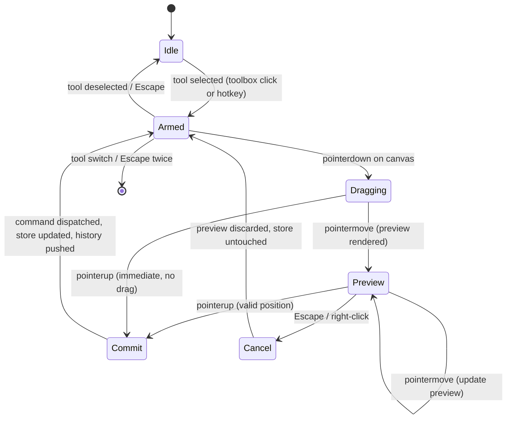
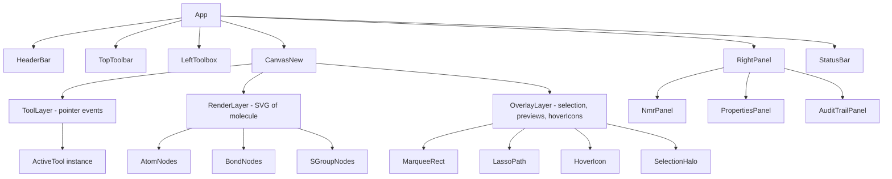
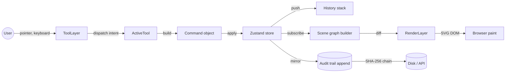
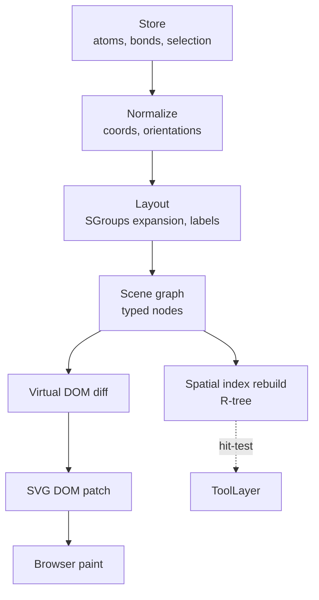
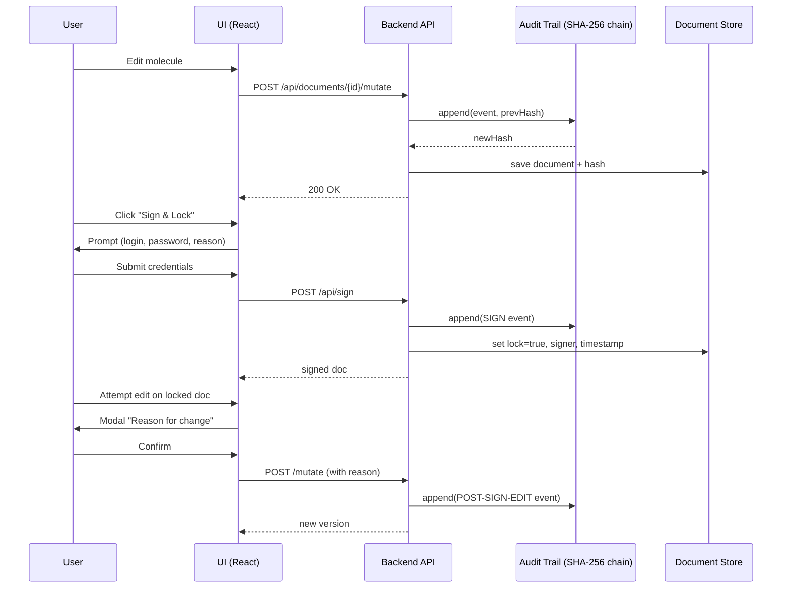

# Product Plan — Paige (Technical Writer) — Wave-4 Kendraw

> Auteur : Paige (BMAD Technical Writer)
> Date : 2026-04-18
> Périmètre : Wave-4 « Redraw » (refonte du canvas inspirée de Ketcher) + piste « Pharma » (conformité GxP, audit, JCAMP, CDXML).
> Objectif : fournir un socle terminologique, lexical et documentaire commun pour que les ingénieurs, QA, PM, UX et utilisateurs finaux parlent la même langue pendant toute la Wave-4.

---

## 1. Glossaire (FR)

Glossaire normatif. Chaque entrée suit le format : **terme** — définition courte, puis contexte Kendraw.

1. **Canvas** — Surface de dessin vectorielle SVG sur laquelle l'utilisateur construit la molécule. Dans Kendraw, composant `CanvasNew` (Wave-4), successeur du `LegacyCanvas` (Wave-1..3).
2. **Toolbox** — Palette latérale gauche groupant les outils actifs (bond, atom, chain, lasso, erase, template). Miroir du `LeftToolbar` Ketcher.
3. **Toolbar** — Barre horizontale supérieure groupant les actions globales (undo, redo, clean-up, zoom, save). Distincte de la toolbox.
4. **Hotspot** — Zone cliquable invisible élargie autour d'un atome/d'une liaison pour tolérer l'imprécision de la souris. Typiquement 8 px de rayon autour d'un atome.
5. **Tool abstraction** — Interface `Tool { onPointerDown, onPointerMove, onPointerUp, onKey, cancel }` qui décrit le cycle de vie unifié de tout outil Kendraw.
6. **Angle snap** — Contrainte d'orientation forçant une liaison à s'aligner sur des multiples de 30° (ou 60°/15° selon réglage) pendant le drag.
7. **Lasso** — Outil de sélection libre : l'utilisateur trace un polygone quelconque ; tous les atomes/liaisons contenus sont sélectionnés.
8. **Marquee** — Outil de sélection rectangulaire par glisser-déposer ; rectangle orthogonal uniquement.
9. **Flood select** — Sélection par propagation : à partir d'un atome, étend la sélection à tout le fragment connexe (composant connexe du graphe moléculaire).
10. **Wedge** — Liaison en triangle plein (pointe vers l'avant), représentant une stéréochimie « up » (au-dessus du plan).
11. **Hash** — Liaison en hachures (coin vers l'arrière), stéréochimie « down » (sous le plan).
12. **Fragment** — Composante connexe du graphe moléculaire ; un dessin peut contenir plusieurs fragments indépendants sur le même canvas.
13. **SGroup** — *Substructure Group* : abstraction de sous-structure (ex. « Ph », « OMe », polymère, générique). Permet de masquer/replier un sous-graphe sous un libellé.
14. **Abbreviation** — Cas particulier de SGroup : libellé court (Ph, Me, Bn, Ts, Boc) qui se déplie en structure complète à la demande.
15. **HoverIcon** — Badge visuel (halo, icône, curseur personnalisé) qui apparaît quand le curseur survole un hotspot pour indiquer l'action possible.
16. **ViewBox** — Attribut SVG définissant la fenêtre visible du canvas en coordonnées utilisateur (x, y, w, h). Pilote zoom et pan.
17. **Drag-commit** — Pattern : tant que l'utilisateur maintient le pointeur enfoncé, l'action est prévisualisée ; elle n'est validée dans le store qu'au relâchement (`pointerup`).
18. **Atomic undo** — Granularité d'annulation : une seule commande utilisateur (même composée de N mutations) = une seule entrée dans la pile undo.
19. **Feature flag** — Drapeau booléen activant/désactivant une fonctionnalité en production. Wave-4 utilise `canvas-new`, `audit-trail`, `e-sign`.
20. **Clean room** — Réimplémentation sans copier le code source d'une référence ; seules les specs publiques et le comportement observable sont autorisés. Kendraw vis-à-vis de Ketcher.
21. **KDX format** — *Kendraw Document eXchange* : format de fichier natif Kendraw (JSON versionné) complémentaire de CDXML et MOL.
22. **Rendering pipeline** — Chaîne `store → scene graph → SVG DOM` : conversion du modèle logique en éléments graphiques.
23. **Spatial index** — Structure (R-tree, grid) qui accélère les requêtes « quel atome est sous (x,y) ? » de O(n) à O(log n).
24. **fracAngle** — Angle fractionné : résidu `angle % snapStep` utilisé pour décider si un angle doit être snappé ou laissé libre (mode « free rotation » au-delà d'un seuil).
25. **CIP** — *Cahn-Ingold-Prelog* : système de règles de priorité pour assigner les descripteurs stéréochimiques R/S et E/Z.
26. **Aromaticity** — Détection d'aromaticité : identification des cycles satisfaisant la règle de Hückel (4n+2 électrons π). Kendraw délègue à RDKit côté backend.
27. **Implicit hydrogen** — Hydrogène non dessiné mais déduit de la valence standard de l'atome. Affichage contrôlé par `showImplicitH`.
28. **Bond order** — Multiplicité d'une liaison : 1 (simple), 2 (double), 3 (triple), 1.5 (aromatique).
29. **Chain tool** — Outil permettant de tracer une chaîne carbonée en zig-zag par glisser, snappé à 30°.
30. **Template** — Structure préconstruite (benzène, cyclohexane, stéroïde) disponible en un clic.
31. **Scene graph** — Arbre intermédiaire entre le store et le DOM SVG ; noeuds typés (AtomNode, BondNode, LabelNode).
32. **Pointer capture** — API web : une fois la souris capturée par un élément, tous les `pointermove` lui sont livrés même hors de la bounding box.
33. **Command pattern** — Chaque mutation du store passe par un objet `Command { apply, revert }` pour supporter undo/redo de manière uniforme.
34. **Store** — Source de vérité unique (Zustand slice `molecule`) contenant atomes, liaisons, sélection, viewBox.
35. **Audit trail** — Journal append-only, haché en chaîne SHA-256, de toutes les modifications apportées à un document réglementé (Wave-4 P1-04).
36. **E-signature** — Signature électronique conforme 21 CFR Part 11 : modale exigeant login + mot de passe + raison du changement avant commit d'un document verrouillé.
37. **Record lock** — Verrou posé sur un document signé : toute modification ultérieure force une nouvelle signature.
38. **JCAMP-DX** — Format texte standard IUPAC pour spectres (NMR, IR, MS). Wave-4 P1-03 ajoute l'import 1D NMR.
39. **CDXML** — Format XML propriétaire ChemDraw ; Wave-4 P1-06 ajoute la lecture/écriture round-trip.
40. **Round-trip** — Test : `parse(write(doc)) == doc`. Garantit qu'un import-export ne dégrade pas la donnée.
41. **Pointer intent** — Classification logique d'un événement pointer : `TAP`, `DRAG`, `HOVER`, `LONG-PRESS`. Calculée par un gestionnaire central à partir de `timestamp` + `distance`.
42. **Hit-test** — Opération consistant à déterminer quel objet (atome, liaison, SGroup, vide) se trouve sous une coordonnée canvas donnée. S'appuie sur le spatial index.
43. **Snap step** — Pas angulaire de snap (par défaut 30°). Paramétrable dans les préférences.
44. **Arm** — Verbe : activer un outil sans encore déclencher d'action (état « Armed » dans la state machine).
45. **Commit** — Verbe : valider l'action prévisualisée dans le store, avec push dans la pile undo.
46. **Cancel** — Verbe : abandonner l'action prévisualisée ; le store reste inchangé.
47. **Ghost preview** — Prévisualisation en opacité réduite de l'élément en cours de création (atome/liaison) pendant un drag.
48. **Selection halo** — Cercle/rectangle de surbrillance autour d'un élément sélectionné ; couleur `var(--color-selection)`.
49. **Bounding box** — Rectangle minimal englobant un ensemble d'atomes/liaisons, en coordonnées canvas.
50. **Zoom level** — Facteur d'échelle entre coordonnées canvas (unité = 1 Å × 40 px) et coordonnées écran.

> Note : glossaire extensible ; voir ADR-W4-G1 si un nouveau terme doit rejoindre ce document.

---

## 2. Crosswalk Kendraw ↔ Ketcher ↔ ChemDraw

Tableau de correspondance pour éviter la confusion lexicale entre les trois écosystèmes. Utile pour les PM qui lisent les specs Ketcher, les utilisateurs ChemDraw en migration, et les devs.

| # | Kendraw | Ketcher (EPAM) | ChemDraw (PerkinElmer) | Notes |
|---|---------|---------------|----------------------|-------|
| 1 | Canvas | Render / ReStruct | Drawing Area | SVG dans Kendraw/Ketcher, natif Cocoa/Win32 dans ChemDraw |
| 2 | Toolbox (gauche) | LeftToolbar | Main Tool Palette | |
| 3 | Toolbar (haut) | TopToolbar | Style Ribbon | |
| 4 | Store (Zustand) | ReStruct + Editor | Document Model | |
| 5 | Atom | Atom | Atom | |
| 6 | Bond | Bond | Bond | |
| 7 | Fragment | Fragment | Fragment | |
| 8 | SGroup | SGroup | Bracketed Group / Label | |
| 9 | Abbreviation | Superatom / SGroup type SUP | Nickname | |
| 10 | Template | Template | Template / Structure Browser | |
| 11 | Lasso | Lasso | Lasso | |
| 12 | Marquee | Rectangle Select | Marquee / Selection Rectangle | |
| 13 | Flood select | Fragment select (double-click) | Select Fragment (Ctrl+Shift+A) | |
| 14 | Angle snap (30°) | Bond angle constraint | Fixed Angle (CMD key) | |
| 15 | Chain tool | Chain tool | Chain tool | |
| 16 | Wedge bond | Stereo Up bond | Bold/Wedged Bond | |
| 17 | Hash bond | Stereo Down bond | Hashed Bond | |
| 18 | Wavy bond | Either Up/Down | Wavy/Undefined | |
| 19 | Clean-up | Layout / Clean | Clean Up Structure | Kendraw délègue à RDKit backend |
| 20 | Atom label | Atom label | Atom Label | |
| 21 | Charge | Charge | Formal Charge | |
| 22 | Radical | Radical | Radical Monovalent/Divalent | |
| 23 | Isotope | Isotope | Mass Number | |
| 24 | R-group | R-Group | R-group | |
| 25 | Query atom | Query Atom / Generic | Query Atom | |
| 26 | Reaction arrow | Reaction Arrow | Reaction Arrow | |
| 27 | Plus sign | Plus | Plus Sign | |
| 28 | Atom mapping | AAM (Atom-Atom Mapping) | Atom-to-Atom Map | |
| 29 | Text annotation | Text | Text Box | |
| 30 | ViewBox | Render zoom | View > Zoom | |
| 31 | Pan | Hand tool | Hand Tool (H) | |
| 32 | Zoom to fit | Zoom to fit | Fit to Window | |
| 33 | Undo/Redo | Undo/Redo | Undo/Redo | |
| 34 | KDX format | KET format | CDX / CDXML | Natif de chaque produit |
| 35 | MOL (V2000) | MOL | MOL | Standard MDL |
| 36 | SDF | SDF | SDF | Multi-molecule |
| 37 | SMILES | SMILES | SMILES | Daylight spec |
| 38 | InChI | InChI | InChI | |
| 39 | Audit trail | (absent) | Notebook log (ELN) | Kendraw P1-04 |
| 40 | E-signature | (absent) | E-Notebook Signature | Kendraw P1-05 |
| 41 | Record lock | (absent) | ELN Lock | Kendraw P1-05 |
| 42 | JCAMP import | (absent) | JCAMP Viewer | Kendraw P1-03 |
| 43 | CDXML I/O | via indigo | Natif | Kendraw P1-06 |
| 44 | Implicit H | Implicit H | Implicit Hydrogens | |
| 45 | Aromaticity | Indigo aromatize | Aromatic bonds | |
| 46 | CIP labels | (partiel) | Assign Stereochemistry | Kendraw utilise RDKit |
| 47 | Hover icon | Hover highlight | Tooltip + highlight | |
| 48 | Hotspot | Atom/bond pick radius | Selection tolerance | |
| 49 | Drag-commit | Editor tool state machine | Dynamic preview | |
| 50 | Atomic undo | History transaction | Undoable action group | |
| 51 | Feature flag | (build-time) | (absent) | Kendraw : runtime, ENV + cookie |
| 52 | Tool abstraction | Tool class hierarchy | Tool plugin | |
| 53 | Spatial index | ReStruct.render.ctab | (interne non documenté) | |
| 54 | Rendering pipeline | Render (Raphael/SVG) | Quartz/GDI | |
| 55 | Scene graph | restruct nodes | Document tree | |

---

## 3. Convention de nommage des stories et commits

### 3.1. Identifiants de stories

Deux pistes parallèles coexistent en Wave-4 :

- **W4-R-XX** : piste *Redraw* — refonte du canvas, outils, rendu, sélection.
  - Ex : `W4-R-01` (tool abstraction), `W4-R-02` (angle snap), `W4-R-03` (lasso).
- **W4-P1-XX** : piste *Pharma phase 1* — conformité, audit, formats réglementés.
  - Ex : `W4-P1-03` (JCAMP), `W4-P1-04` (audit trail), `W4-P1-05` (e-sign), `W4-P1-06` (CDXML).

Règle : l'ID est attribué à la création de la story et ne change jamais, même si la story est replanifiée ou splittée (dans ce cas on ajoute un suffixe `a`, `b`, ...).

### 3.2. Scopes de commit

Le scope du commit Conventional Commits identifie le sous-système touché :

| Scope | Sous-système |
|-------|--------------|
| `canvas-new` | Canvas Wave-4 (composants React, rendu SVG) |
| `tools` | Implémentations d'outils (bond, atom, chain, lasso, erase) |
| `store` | Slices Zustand (`molecule`, `selection`, `history`) |
| `commands` | Commandes undo/redo (`AddAtom`, `MoveSelection`, ...) |
| `io` | Parseurs/writers (SMILES, MOL, CDXML, JCAMP, KDX) |
| `persistence` | Audit trail, e-signature, record lock |
| `ui` | Toolbar, toolbox, dialogs, panneaux |
| `nmr` | Prédiction/rendu NMR |
| `a11y` | Accessibilité, navigation clavier, ARIA |
| `docs` | Documentation |
| `ci` | Pipelines, hooks, scripts |

### 3.3. Gabarit

```
<type>(<scope>): <description brève au présent> — wave-4 <STORY-ID>
```

Exemples conformes :

```
feat(canvas-new): tool abstraction with pointer lifecycle — wave-4 W4-R-01
feat(tools): angle snap at 30° for bond tool — wave-4 W4-R-02
feat(io): cdxml writer with parse round-trip — wave-4 P1-06
fix(store): atomic undo groups drag-commit mutations — wave-4 W4-R-09
docs(canvas-new): document hoverIcon contract — wave-4 W4-R-14
```

Types autorisés : `feat`, `fix`, `refactor`, `test`, `docs`, `chore`, `ci`, `perf`, `build`.

---

## 4. Impact documentaire (Doc impact map)

| Document | Action | Motivation |
|----------|--------|-----------|
| `README.md` | **Mettre à jour** | Ajouter mention feature flag `canvas-new`, pointer vers `docs/getting-started.md` pour la migration, crédit Ketcher dans la section « Acknowledgements ». |
| `docs/keyboard-shortcuts-compliance.md` | **Mettre à jour** | Ajouter raccourcis nouveaux outils Wave-4 (L = lasso, M = marquee, Shift+L = flood select, Alt = lock angle, Esc = cancel tool). Mettre à jour tableau de conformité ChemDraw. |
| `docs/getting-started.md` | **Mettre à jour** | Nouveau paragraphe « Passer au canvas Wave-4 » : activation via settings, différences avec le legacy, comment revenir en arrière. |
| `docs/THIRD-PARTY-NOTICES.md` | **À CRÉER** | Fichier obligatoire listant les dépendances tierces. Doit inclure : mention Ketcher (Apache-2.0, EPAM Systems) en tant que « inspiration architecturale — clean-room reimplementation ». Lister également RDKit (BSD-3), React, Zustand, etc. |
| `docs/accessibility.md` | **Mettre à jour** | Nouveau chapitre Wave-4 : focus ring sur atomes sélectionnés, annonce ARIA-live des actions d'outil, navigation clavier dans la toolbox, contraste des hoverIcons (WCAG AA). |
| `docs/architecture-kendraw-2026-04-12.md` | **Mettre à jour** | Ajouter schéma canvas-new, section « Tool abstraction », pointer vers ce product-plan-paige.md pour le glossaire. |
| `docs/adr/` | **À CRÉER** ADR-W4-01 (tool abstraction), ADR-W4-02 (clean-room Ketcher), ADR-W4-03 (audit trail hash chain). |
| `docs/api-endpoints-map.md` | **Mettre à jour** | Nouveaux endpoints `/api/audit/*`, `/api/sign/*`, `/api/jcamp/*`, `/api/cdxml/*`. |
| `docs/deferred-work-wave-4.md` | **Mettre à jour** | Synchroniser les items reportés après rédaction finale. |
| `CHANGELOG.md` | **Mettre à jour** | Section `[Unreleased]` > `## Wave-4`. |

### Chaîne de validation documentaire

1. Auteur (Dev/QA/PM) propose le diff doc dans la PR de la story.
2. Paige (Tech Writer) review la cohérence terminologique vs. glossaire.
3. PM approuve pour merge.
4. Release notes générées automatiquement depuis le changelog à chaque tag.

---

## 5. Diagrammes Mermaid

### 5.1. État du cycle de vie d'un outil (`Tool Lifecycle State Diagram`)



### 5.2. Arbre de composants (`Component Tree`)



### 5.3. Flux de données (`Data Flow: input to render`)



### 5.4. Pipeline de rendu (`Rendering Pipeline`)



### 5.5. Piste Pharma — chaîne d'audit et e-signature (`Pharma Trust Chain`)



---

## 6. Règles d'emploi du glossaire

- Tout nouveau terme introduit dans une story Wave-4 DOIT être ajouté ici avant merge.
- Les noms de fichiers, de composants et de stores SUIVENT la terminologie du glossaire (ex. `CanvasNew`, `ToolLayer`, `OverlayLayer`, `AuditTrail`).
- Les traductions UI française et anglaise utilisent le terme du glossaire colonne « Kendraw ».
- Les screenshots de documentation annotent les zones avec les termes du glossaire (toolbox, toolbar, hoverIcon, selection halo).

---

## 6 bis. Style guide documentaire (extrait)

Règles de rédaction applicables à tous les documents `docs/*.md` produits en Wave-4 :

- **Langue** : français pour les documents de spec, de produit et d'architecture interne ; anglais pour les commentaires de code, messages d'erreur techniques, noms de composants.
- **Titres** : sentence case en français (« Cycle de vie d'un outil »), title case en anglais (« Tool Lifecycle »).
- **Accents** : obligatoires en français, y compris sur les majuscules (« À », « É »).
- **Code inline** : en `backticks` systématiquement pour les identifiants (noms de variables, fichiers, classes, commandes).
- **Liens** : relatifs dans le repo (`../getting-started.md`), absolus uniquement pour les références externes.
- **Images** : dans `docs/assets/`, nommées `wave4-<topic>-<version>.svg` ou `.png`.
- **Diagrammes** : Mermaid préféré au PNG statique car reviewable en diff Git.
- **Exemples de code** : toujours exécutables ou testables ; pas de pseudo-code flou.

---

## 7. Checklist de sortie Wave-4 (doc-only)

- [ ] Glossaire revu par 1 dev + 1 PM + 1 UX
- [ ] Crosswalk validé par un utilisateur ChemDraw senior (interne)
- [ ] README mis à jour avec feature flag + crédits
- [ ] `THIRD-PARTY-NOTICES.md` créé et lié depuis README
- [ ] `keyboard-shortcuts-compliance.md` regénéré depuis le code
- [ ] `getting-started.md` avec section migration legacy → canvas-new
- [ ] `accessibility.md` section Wave-4 ajoutée
- [ ] Tous les diagrammes Mermaid compilent sans erreur dans Markdown preview
- [ ] Les 5 ADR Wave-4 rédigés et mergés
- [ ] Release notes Wave-4 signées par le Tech Writer

---

## 8. Références externes

- Ketcher source — https://github.com/epam/ketcher (Apache-2.0)
- ChemDraw User Guide (PerkinElmer) — référence interne `docs/chemdraw-technical-reference.md`
- CDXML Schema — CambridgeSoft / PerkinElmer
- JCAMP-DX spec — IUPAC, *Pure & Appl. Chem.* 60 (1988)
- 21 CFR Part 11 — FDA, Electronic Records / Electronic Signatures
- WCAG 2.2 AA — W3C

---

## 9. Annexe A — Matrice de traduction UI (FR/EN)

Pour la cohérence des libellés dans l'interface utilisateur et dans les captures de documentation :

| Clé i18n | FR | EN |
|----------|----|----|
| `tool.bond` | Liaison | Bond |
| `tool.atom` | Atome | Atom |
| `tool.chain` | Chaîne | Chain |
| `tool.lasso` | Lasso | Lasso |
| `tool.marquee` | Sélection rectangulaire | Marquee |
| `tool.erase` | Gomme | Erase |
| `tool.template` | Gabarit | Template |
| `action.undo` | Annuler | Undo |
| `action.redo` | Rétablir | Redo |
| `action.cleanup` | Nettoyer la structure | Clean up structure |
| `action.sign` | Signer et verrouiller | Sign & Lock |
| `panel.nmr` | Spectre RMN | NMR spectrum |
| `panel.audit` | Journal d'audit | Audit trail |
| `panel.properties` | Propriétés | Properties |
| `dialog.reason` | Raison du changement | Reason for change |
| `toast.saved` | Document enregistré | Document saved |
| `toast.signed` | Document signé | Document signed |
| `error.invalid_smiles` | SMILES invalide | Invalid SMILES |

## 10. Annexe B — Termes à bannir

Pour éviter l'ambiguïté, ces termes ne doivent **PAS** apparaître dans la documentation Kendraw :

- « molecule canvas » (préférer : « canvas »).
- « chemical drawing tool » (préférer : « outil » avec le type précis : bond, atom, ...).
- « selection tool » seul (préférer : « lasso », « marquee », « flood select »).
- « toolbar » pour désigner la palette gauche (c'est la **toolbox**).
- « rich text » dans un contexte chimie (confusion avec annotations texte ; préférer « atom label » / « text annotation »).
- « legacy canvas » en production (acceptable uniquement en doc interne de migration).

---

*Fin du product-plan-paige.md — Wave-4 Kendraw.*
